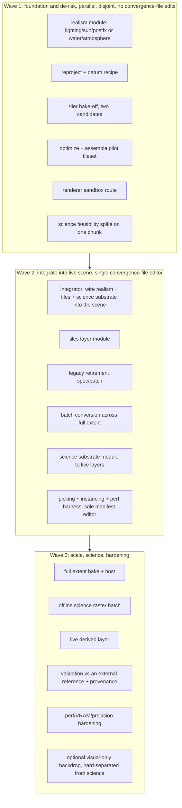

# 3d-twin waveset charter template

Date: 2026-06-27 (America/New_York)
Lane: O0 orchestrator
Home: `.cca/catalogue/O0/20260627_3d-twin/`

A reusable charter template for building a realistic geospatial 3D digital twin and
unifying its render geometry with a downstream spatial-science consumer. It is the
generalized form of the pax "Realistic NYC 3D viewer" waveset (DoITT buildings as 3D
Tiles + shading upgrade + shared shade geometry). Use it to ground a new waveset charter:
copy this directory, fill the placeholders, and keep the execution model intact.

Reference implementation (read-only lineage):
- pax plan: `~/.cursor/plans/realistic_nyc_3d_viewer_c0b6b2b4.plan.md`
- pax viewer: `pax_v0/lib/comfort/viewer/createComfortMapViewer.ts`, `constants.ts`

Worked example carried through this template: a terrain + bathymetry twin (land DEM joined
to seafloor bathymetry across a coastline, rendered in one scene, with the same geometry
feeding a spatial-science consumer such as depth/habitat or line-of-sight analysis).

---

## 0. How to use this template

1. Copy this directory to a new dated home and rename it for your project.
2. Fill section 1 (decision record) first. Do not launch agents until the decisions are made.
3. Keep section 2 (execution model) verbatim. It is the hard-won part.
4. Instantiate the three waves in section 3 against your data and viewer.
5. Use section 4 as the literal per-agent prompt skeleton.
6. Hold the operator gates in section 6.

The method generalizes to any pipeline shaped as: external geometry source, reproject and
mesh, tile and host, render in an existing scene, then make a science consumer share the
same geometry.

---

## 1. Decision record (answer before launch)

Record each decision with a one-line rationale and a source. These mirror the NYC charter's
"why this approach" block.

| Decision | Options | Rule that decided it (fill in) |
|----------|---------|--------------------------------|
| Geometry source | self-hosted owned data vs managed/commercial tiles | Pick owned data when a science/measurement consumer needs to extract geometry; managed photoreal tiles often forbid measurement and geodata extraction. |
| Tile format | OGC 3D Tiles 1.1 (glTF), quantized-mesh terrain, custom binary | 3D Tiles 1.1 renders in plain Three.js via `3d-tiles-renderer` with no Cesium runtime; keeps existing overlays native. |
| Render runtime | extend existing Three.js scene vs adopt new engine | Extend the existing scene so route/camera/overlay code is preserved. |
| Single source of truth | one geometry feeds both render and science vs two pipelines | One source (vector mesh for render, rasterized field for offline science) prevents geometry drift between the picture and the numbers. |
| Conversion host | local vs shared host vs dedicated cloud box | Heavy converters (PostGIS, tilers) are unstable under CPU-arch emulation; run them natively on the matching architecture. |

Worked-example fills (terrain + bathymetry):
- Source: owned/public DEM (e.g. USGS 3DEP) plus bathymetry (e.g. NOAA NCEI / GEBCO / multibeam). Both licensed for measurement.
- Vertical datum reconciliation is the analog of the NYC feet-to-meters and z-up-to-y-up fix: terrain is usually on a land vertical datum (e.g. NAVD88 / ellipsoid), bathymetry on a tidal datum (e.g. MLLW / mean sea level). Convert both to one metric vertical reference before meshing, or the coastline will not join.
- Coastline seam handling is the analog of the NYC "double-drawn buildings" gate: terrain and bathymetry must meet at the shoreline with no gap and no overlap.

---

## 2. Waveset execution model (keep verbatim)

Work is chartered as sequential waves. Each wave runs several subagents fully in parallel.
Wave N+1 starts only after Wave N integrates and lands.

Parallelism discipline (prevents write collisions):

1. One file, one owner per wave. Each agent owns a distinct file or directory. No two agents
   in the same wave edit the same file.
2. The convergence file (the live viewer / scene assembler) has exactly one editor per wave,
   the integrator. Every other agent that needs viewer behavior ships a standalone module
   plus a thin wiring spec, and the integrator applies the wiring.
3. Foundation agents (the first wave) create new files and infrastructure only. They do not
   touch the convergence file at all, so they cannot collide.
4. Exactly one agent per wave may edit the dependency manifest (package.json or equivalent).
   Every other agent in that wave adds no dependencies.
5. No agent runs a shared dev server or full build during a parallel wave. Concurrent builds
   collide on shared build directories. Validate with a type-check or unit check only.
6. Large artifacts (tilesets, rasters, meshes) go to object storage, never to git.
7. Each agent returns the return contract in section 6. Each wave ends with one integration
   commit and push.
8. Honesty constraint carried into every wave: modeled outputs stay labeled "modeled, not
   measured"; no agent invents coverage or metrics it did not produce.



---

## 3. The three waves (generic roles + worked-example fills)

### Wave 1: foundation and de-risk (5 or more parallel, disjoint, no convergence-file edits)

| Role | Generic deliverable | Terrain + bathymetry fill |
|------|---------------------|---------------------------|
| Realism module | a standalone scene-realism module against a throwaway scene | water surface shader + atmosphere/fog + sun; ocean depth color ramp |
| Reproject + datum recipe | scripts that reproject the source to a clean metric mesh | reproject DEM and bathymetry to one projected CRS, unify vertical datums to one metric reference, mesh both, weld the coastline seam |
| Tiler bake-off | convert one chunk two ways, compare size/draw calls/fidelity, recommend one | meshed-DEM-to-3D-Tiles vs quantized-mesh terrain tiles for one coastal tile |
| Optimize + assemble pilot | compress and assemble one valid pilot tileset; report real sizes | gltfpack/meshopt + validator on one coastal chunk |
| Renderer sandbox | isolated route that mounts a pilot tileset via `3d-tiles-renderer`, no convergence-file edits | mount the coastal pilot, confirm terrain and seafloor both load |
| Science feasibility spike | rasterize one chunk, confirm the science tool ingests it, prototype a derived layer | depth field or slope/aspect raster from the same mesh; prototype a derived habitat or line-of-sight layer |

Gate to Wave 2: the pilot tileset validates AND the sandbox renders it.

### Wave 2: integrate into the live scene (single convergence-file editor)

| Role | Generic deliverable | Terrain + bathymetry fill |
|------|---------------------|---------------------------|
| Integrator (sole convergence-file editor) | wire realism + tiles + science substrate into the live scene per wiring specs | enable water rendering, mount terrain+bathymetry tiles, mount the depth/derived substrate |
| Tiles layer module | reusable tiles factory: mount/update/dispose, LoD/culling | one factory serving both terrain and bathymetry tilesets in the local frame |
| Legacy retirement | spec/patch removing the old placeholder geometry once tiles cover the extent; keep an optional fallback toggle | retire any flat-plane/placeholder seabed once real tiles cover the area |
| Batch conversion | run the recipe across the full extent into one tileset | convert the whole study area, terrain and bathymetry, with seam handling |
| Science substrate module | derived field computed from tile geometry feeding live layers | depth/slope/visibility texture feeding the live layers |
| Picking + props + perf (sole manifest editor) | accelerated picking + instancing + perf harness | pick seabed/terrain cells; instance repeated markers; measure draw calls/frame time |

Gate to Wave 3: the scene renders the full-extent tiles with upgraded realism at interactive
frame rate; the legacy placeholder path is removed.

### Wave 3: scale, science productionization, hardening (5 or more parallel)

| Role | Generic deliverable | Terrain + bathymetry fill |
|------|---------------------|---------------------------|
| Full-extent bake + host | bake and host the full tileset on the existing CDN/origin; wire the live URL | host terrain+bathymetry tiles, wire the viewer to the hosted URL |
| Offline science batch | calibrated science rasters for the consumer | depth-derived habitat / propagation rasters for a few scenarios |
| Live derived layer | a runtime-computed derived layer | e.g. live visibility or reachable-depth layer |
| Validation + provenance | cross-check against an external reference, add the provenance line and an error band | compare bathymetry against an authoritative chart; add "modeled, not measured" provenance and RMSE band |
| Perf hardening | VRAM/draw-call audit, texture compression, float-precision/origin-shift, optional WebGPU with WebGL2 fallback | origin-shift for large-extent float precision; KTX2 textures |
| Optional visual-only backdrop | a gated visual-only basemap, never an input to the science pipeline | optional satellite/photoreal backdrop, hard-separated from depth science |

---

## 4. Per-agent prompt skeleton (copy-paste)

Every parallel agent gets a self-contained prompt. It has no conversation history, so include
all context. Fill the brackets.

```
You are agent [WAVE-LETTER] in Wave [N] of the [PROJECT] charter.
Charter: [path to this charter]. Reference implementation: [path to the NYC plan].

GOAL OF THE CHARTER: [one sentence].

REPO(S): [paths, stack, push policy].

PRIOR-WAVE OUTPUTS YOU BUILD ON (all landed): [module APIs with exact signatures, hosted
URLs, host coordinates, commit hashes, file line references].

YOUR TASK: own NEW file/dir [path]. [Exact deliverable and exported API signature.]

DELIVERABLES: [the file(s)] + [WIRING-<name>.md telling the integrator exactly how to mount it].

VALIDATION: [type-check / unit check only]. Report the real result.

COLLISION-AVOIDANCE:
- Do NOT edit the convergence file [path] (the integrator is its sole editor).
- Do NOT run a dev server or full build (shared build dir collides). Validate with [type-check] only.
- Do NOT modify the dependency manifest unless you are the designated manifest editor.
- Commit ONLY your owned files; pull --rebase then push (retry on race); large artifacts to object storage.
- Be honest about what you verified vs assumed; label modeled outputs "modeled, not measured".

When done, return: exported API, decisions made, validation result, commit hash, risks.
```

---

## 5. Collision-avoidance rules (hard-won, do not relax)

These were learned from a parallel wave that raced on a shared build directory and the
dependency manifest, and from converters that crashed under CPU-architecture emulation.

1. Single convergence-file editor per wave. Everyone else ships a module plus a wiring spec.
2. Single dependency-manifest editor per wave.
3. No dev server, no full build, during a parallel wave. Type-check only.
4. Heavy native converters (PostGIS, tilers) run natively on the matching CPU architecture,
   not under emulation. Provision a matching-arch box and confirm reachability first.
5. Large artifacts go to object storage; only scripts, specs, and small results go to git.
6. Each wave ends with one integration commit and push, with the branch verified synced.

---

## 6. Gates and return contract

Operator approval gates (the orchestrator pauses for these):
- Decision record in section 1 confirmed before any launch.
- Conversion host choice confirmed before the first heavy conversion.
- Any commit or push (orcast write policy: only on explicit operator request).
- Wave N to Wave N+1 promotion, after the stated gate is met.

Per-agent return contract:
- files owned, wiring spec (if its output must be mounted), measured results, risks, commit hash.

Per-wave exit:
- the named gate met, one integration commit, branch synced.

---

## 7. Open questions to confirm before launching

- Scope of the first wave: include the science spike, or run the first wave purely on getting
  real geometry rendering and move the science spike to a later track?
- Conversion host: local, shared, or a dedicated matching-arch cloud box?
- Subagent model: inherit the orchestrator's, or pin a specific model for build-heavy agents?
- Worked-example specifics for terrain + bathymetry: which DEM and which bathymetry source,
  which target CRS and vertical reference, and what is the downstream science consumer?
