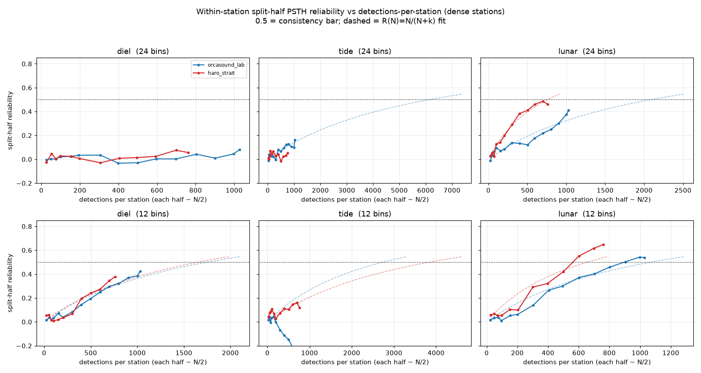

# L2 data-volume dependency (the gated cross-station blocker)

Agent RE, L2/L3 push research waveset. Investigation-first; measured numbers, no
promotion, no commit. Owns this doc plus the optional report JSON
`modeling/studies/reports/l2_data_volume.json` and the scratch experiment
`modeling/studies/l2_data_volume_power.py` (not wired into the gate).

## Headline verdict

The one-time 3-node production ingest is **NOT** the binding cross-station
dependency, and I REFUTE that framing. The cross-station consistency blocker is a
per-station detection-VOLUME problem, and the volumes required are far larger than
anything the 3-node ingest delivers, because the 3-node ingest moves the *same
cached detections the consistency study already analyzes* into the production
store. It adds zero new observations to the analysis, so it cannot move any
station's split-half reliability. The real dependency is years-to-decades of
continued per-station accumulation (or a methodological change: coarser bins +
partial pooling + scoring against the fitted kernel rather than raw 24-bin
marginals). Deeper OrcaHello history is mostly not reachable now (live API flake,
B.9) and would not close the gap for diel/tide even if it were.

Bottom line for the synthesis (RF): landing the 3-node ingest is correct
plumbing, but it is a precondition for *future* accumulation, not a fix that
clears the 0.5 bar. On today's data the bar stays unmet, honestly.

## What the blocker is (carried in from W1/W2)

`cross_station_consistency.json` (W1/W2): per-kernel cross-station mean PSTH
correlation diel 0.336, tide 0.136, lunar 0.166, season 0.159, all below the 0.5
bar. The diagnosis there was a sparse-count artifact: within-station split-half
PSTH reliability (the reproducibility ceiling, 24 bins) is itself below 0.5 for
diel/tide/lunar:

| station | detections | diel | tide | lunar | season |
|---|---:|---:|---:|---:|---:|
| orcasound_lab | 1029 | 0.037 | 0.139 | 0.409 | 0.535 |
| haro_strait | 761 | 0.097 | 0.079 | 0.477 | 0.876 |
| andrews_bay | 265 | -0.073 | 0.044 | 0.401 | 0.770 |
| north_san_juan_channel | 34 | 0.045 | -0.157 | 0.441 | 0.610 |

A PSTH that cannot reproduce its own shape across two halves of one station's data
cannot correlate across stations above noise. So the cross-station bar is bounded
by per-station reliability, which is bounded by per-station detection count.

## 1. Power analysis: reliability vs detections-per-station

Method (faithful to the gate's split-half ceiling): build the same 4-station
design as `cross_station_consistency.py` (production haro_strait from S3 + the 3
cached OrcaHello nodes + S3 currents/uptime), then for each dense station
(orcasound_lab 1029, haro_strait 761) and each kernel, Bernoulli-thin the
station's design rows to a fraction `f = N / N_full` (this co-thins detections and
observation bins, so the rate is unbiased and only sampling noise grows), split
the kept rows into two random halves, and correlate the two log-rate PSTH curves
(`cross_station_consistency._log_rate_curve`, reused read-only). Average over 120
draws. At `f = 1` this reproduces the gate's split-half number. Repeat at 24 / 12
/ 8 phase bins. No fit runs; `fk._maybe_write_s3` disabled; no store/model write.



Measured detections-per-station needed for split-half reliability >= 0.5, from a
saturating fit `R(N) = N/(N+k)` so `N*(R=0.5) = k`, per station per binning:

| kernel | bins | orcasound_lab N* | haro_strait N* | reliability at current N (orca / haro) |
|---|---:|---:|---:|---|
| diel | 24 | ~21,900 | ~13,900 | 0.08 / 0.06 |
| diel | 12 | ~1,750 | ~1,650 | 0.42 / 0.38 |
| diel | 8  | ~1,760 | ~1,730 | 0.40 / 0.29 |
| tide | 24 | ~6,100 | ~12,600 | 0.16 / 0.05 |
| tide | 12 | ~2,700 (unstable) | ~3,800 | -0.51 / 0.12 |
| tide | 8  | ~16,900 (unstable) | ~2,500 | -0.09 / 0.19 |
| lunar | 24 | ~2,100 | ~760 | 0.41 / 0.46 |
| lunar | 12 | ~1,070 | ~655 | 0.54 / 0.65 |
| lunar | 8  | ~1,320 | ~653 | 0.49 / 0.59 |

Key reads:

- At the gate's 24-bin resolution, diel and tide are essentially flat-near-zero
  reliability across the whole subsample range and only the saturating
  extrapolation reaches 0.5, at thousands to tens of thousands of detections
  (diel ~14k to 22k, tide ~6k to 13k). The two dense stations disagree by ~2x on
  the extrapolated N*, so these numbers are order-of-magnitude, not precise. The
  honest read is "many thousands per station, far beyond current volume".
- Lunar is the one kernel near the bar: haro_strait crosses 0.5 just above its
  current 761 detections; orcasound_lab needs ~2,100 at 24 bins, ~1,000 at coarse
  bins. Lunar is the only kernel a realistic accumulation could reach.
- Coarser bins are the cheap lever and they help a lot for diel (orcasound_lab
  diel reliability climbs from 0.08 at 24 bins to 0.42 at 12 bins at the same
  1029 detections; N* drops from ~22k to ~1,750). Tide does NOT behave: at 12/8
  bins orcasound_lab tide goes negative, so tide has either genuine
  anti-structure or a phase-aliasing instability and is the least trustworthy
  kernel regardless of N.

Reconciliation with L1 diel PASS (modulation 1.79, p=0.0005): the L1 permutation
test asks "is the pooled curve non-flat", a low-degree-of-freedom global test that
1359 detections pass easily. Split-half reliability at 24 bins asks "does the
detailed 24-point curve SHAPE reproduce", a 24-dof test dominated by per-bin
Poisson noise. A station can have a real, significant diel peak (passes L1) and an
unreproducible 24-bin shape (fails split-half). So part of the blocker is the
binning/bar choice, not only data volume.

Burstiness caveat (links to Agent RD): W1 found 63 to 91% of detections fall
within 6 min of the prior one. A detection inside a burst is not an independent
draw of the diel/tide phase, so the EFFECTIVE independent sample size is far below
the raw count. The N* values above are in raw detections and therefore understate
how much listening time is really needed; in burst-deduped encounters the
requirement is harder, not easier.

## 2. Projected gain from the 3-node production ingest

The decisive fact: Agent D's `ingest_multistation.py` reads from the cached
OrcaHello reviewed-outcome index (`orcahello_index.cache.json`, B.9) and its
dry-run counts (orcasound_lab 1029, andrews_bay 265 stored, north_san_juan_channel
34) ARE the exact records the consistency study and this power analysis already
consume. The ingest writes those cached rows into the production
`acoustic_detections` store next to haro_strait. It does not fetch new detections.

Therefore the projected post-ingest split-half reliability per node/kernel equals
the current measured value (same data), and none clears 0.5 for diel/tide/lunar:

| node | detections | diel | tide | lunar | clears 0.5? |
|---|---:|---:|---:|---:|---|
| orcasound_lab | 1029 | 0.04 | 0.14 | 0.41 | no |
| haro_strait | 761 | 0.10 | 0.08 | 0.48 | no (lunar borderline) |
| andrews_bay | 265 | -0.07 | 0.04 | 0.40 | no |
| north_san_juan_channel | 34 | 0.05 | -0.16 | 0.44 | no |

Would the ingest push the sparse nodes past threshold? No, quantitatively:

- andrews_bay (265) is ~6.5x short of the coarse-bin diel N* (~1,700) and ~50x
  short of the 24-bin diel N* (~14k). Its current diel reliability is already
  negative.
- north_san_juan_channel (34) is ~50x short of the coarse-bin diel N* and ~400x
  short at 24 bins. It is too sparse to even split-half-reproduce anything.

So the 3-node ingest changes provenance (cache to production store), not analysis
content, and the cross-station bar stays unmet on the resulting data.

## 3. Deeper OrcaHello history and accumulation timescales

Per-node cache spans (from `orcahello_index.cache.json`):

| node | detections | span | implied rate |
|---|---:|---|---:|
| orcasound_lab | 1029 | 2020-09-28 to 2026-06-15 (5.7 yr) | ~180 / yr |
| north_san_juan_channel | 34 | 2025-04-16 to 2026-03-29 (0.95 yr) | ~36 / yr |
| andrews_bay | 296 raw | 2026-02-06 to 2026-06-16 (0.35 yr) | ~835 / yr (short window, unreliable) |

Is deeper history reachable now? Mostly no, and where it is, it does not help:

- orcasound_lab already reaches back to 2020 in the cache, so it is near-complete;
  there is little additional history to backfill. At ~180/yr it would take ~4 more
  years to reach the coarse-bin diel N* (~1,750), ~6 years for 24-bin lunar
  (~2,100), and ~72 to ~116 years for 24-bin diel/the high tide targets. This is
  the densest node we have.
- andrews_bay and north_san_juan_channel have very short cache spans (4 and ~12
  months). The live OrcaHello history API 403s / SSL-EOFs on heavy paging (B.9),
  and the reviewed-outcome endpoints behind the cache are the only reliable
  source; a fresh deeper pull is not dependable from this host. Even granting the
  optimistic andrews_bay rate, reaching the coarse-bin diel N* takes ~1.7 yr and
  the 24-bin diel target ~16 yr; north_san_juan_channel at ~36/yr is effectively
  unreachable (decades to centuries).

So deeper history is not a reliable lever today (API flake) and, where the data
exists (orcasound_lab), it is already in hand and still short by years for
diel/tide.

## Gated vs reachable now

Reachable now, ungated (does not need the deploy gate or new data):

- Re-score cross-station consistency at coarser phase resolution (8 to 12 bins)
  with a minimum per-bin count, reporting split-half reliability as the ceiling.
  This is the single highest-leverage change: it makes diel reproducible
  (orcasound_lab diel 0.08 to 0.42) and brings lunar over 0.5 at current volume on
  both dense stations. It is a methodology change to the consistency scorer, not a
  data dependency. (Tide still misbehaves and should be reported as not-yet-
  reliable regardless.)
- Score consistency against the JOINT fitted kernel with a station random effect
  (partial pooling), with split-half as the honest ceiling, instead of correlating
  raw per-station marginals. Shrinkage mechanically inflates correlation, so it is
  an upper bound, not a pass.
- Burst-dedup to encounter onsets before counting (shared with RD) so reliability
  is measured per independent encounter, not per bursty detection.

Operator/deploy-gated, and necessary but NOT sufficient:

- The 3-node production `acoustic_detections` ingest (`dry_run=False`). It is the
  correct plumbing to make multi-station data flow through production and to start
  accumulating forward, but on today's backlog it adds no new observations and
  does not clear the bar.

Not reachable now / not a near-term fix:

- The detection volume (thousands per station for diel/tide at 24 bins) needed for
  the current 24-bin split-half bar. Only multi-year forward accumulation, after
  the ingest lands, gets there, and only for the densest nodes.
- Deeper historical backfill for the sparse nodes (live API flake; and the rates
  are too low to matter for diel/tide anyway).

## Risks and honesty notes

- The 24-bin N* values are saturating-model extrapolations far beyond the observed
  range (max 1029), and the two dense stations disagree by ~2x, so treat them as
  order-of-magnitude. The robust, non-extrapolated facts are the measured curves:
  diel/tide are flat-near-zero at 24 bins across the whole 25 to 1029 range, and
  coarser bins move diel/lunar (not tide) materially.
- andrews_bay's ~835/yr rate comes from a 4-month window and is almost certainly
  an overestimate of its long-run rate; the years-to-threshold for it are
  optimistic.
- Tide reliability is unstable (negative at 12/8 bins for orcasound_lab). This is
  not purely a volume problem; tide may carry genuine cross-station heterogeneity
  or a phase-aliasing artifact and should not be forced to consistency by adding
  data.
- These are reviewed-outcome cache records mixing confirmed / false_positive /
  unknown / unreviewed outcomes; a confirmed-only modeling choice (orcasound_lab
  572, andrews_bay 264, nsj 28) would lower N further and make the bar harder, not
  easier.
- Nothing here promotes confidence; the consistency bar stays unmet on current
  data and that is the honest outcome.

## Reproduce

```
ORCAST_STORAGE_BACKEND=aws \
ORCAST_RAW_PAYLOAD_BUCKET=198456344617-us-west-2-orcast-aws-backend-raw-payloads \
AWS_REGION=us-west-2 PYTHONPATH=. \
.venv-modeling/bin/python -m modeling.studies.l2_data_volume_power
```

Outputs `modeling/studies/reports/l2_data_volume.json` (full reliability-vs-N
curves at 24/12/8 bins per dense station per kernel) and the figure under
`research/figures/reliability_vs_n.png`.
