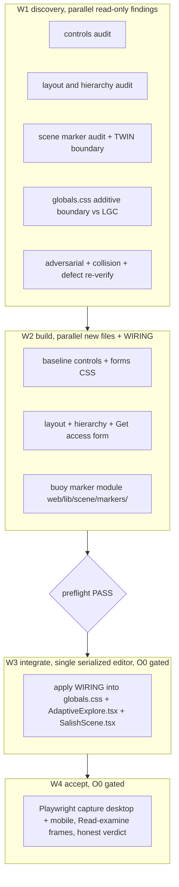

# CVP waveset charter (console visual pass, baseline design layer)

- Lane code: **CVP**
- Owner: O0 (central orchestrator) dispatches; a background sub-orchestrator runs the waves.
- Type: **discovery-first** (Wave 1 read-only); build/integrate/accept waves are gated.
- `repo_state_verified_against`: `main 97b6397` (current HEAD; the tree has advanced past LGC's
  `d19fd56` pin and the WFX/ORCA `915e4cc` pin).
- Charter method: `~/.cursor/skills/waveset-orchestration/SKILL.md`.

## Intent (operator)

Ship the full explore-console visual pass as the **baseline design layer** for `web/`. The home
console renders native, unstyled OS controls and a cramped composer, and the hydrophone beacon is a
large yellow cone that dominates the frame. CVP is a separate fast lane that fixes baseline
correctness and adds a real component design system. The liquid-glass console (LGC) lane layers its
glass identity on top of this baseline later. The fix does not fold into LGC and does not supersede
it.

## Grounding (verified paths, the real defects)

Verified by reading the live source at `main 97b6397`.

1. **No component classes.** `web/app/globals.css` defines **no `.chip` rule** and **no base
   `button` / `textarea` / `input` / `label` styles**. A repo-wide grep for `.chip {` returns zero.
   So every `<button className="chip">` (for example `web/app/components/AdaptiveExplore.tsx:330`)
   and the bare `<button>` / `<textarea>` on the home render as native unstyled OS controls. The
   styled `.ask-label` / `.ask-textarea` classes already exist at `globals.css:308-318`, but the
   home composer does not use them.
2. **Cramped composer.** The home composer is a raw
   `<label>Ask about the Salish Sea <textarea rows={2}>` at
   `web/app/components/AdaptiveExplore.tsx:335-343`, with no width, so it sits inline and cramped
   beside the label text.
3. **Beacon dominates the frame.** The hydrophone beacon is a 6-sided cone
   `coneGeometry args={[1.6, 5, 6]}` in `#ffcf33` at
   `web/app/components/scene/SalishScene.tsx:354-357`, scaled large enough to dominate the frame.

### The central risk: a hot convergence surface

Three files CVP must edit are already owned by chartered or dispatched lanes, all serialized through
O0:

- `web/app/globals.css` — LGC-W4 token drop and `.glass-surface`; TWIN W-LABELS `.scene-label`;
  WFX-INTEGRATE.
- `web/app/components/AdaptiveExplore.tsx` — CXR-1 copy redaction (dispatched, commit gated to O0).
- `web/app/components/scene/SalishScene.tsx` — TWIN W2.6 / W-CAM / W-PERFUX-BUILD / W-LABELS,
  WFX-INTEGRATE, ORCA-OINT.

CVP carries an explicit collision lock and a hard boundary so it does not race or pre-empt those
lanes. The integration wave is a single serialized editor, gated on O0, and it runs the preflight
first.

## Locked decisions (do NOT reopen)

- **Target surface is `web/` only** (Next 14 / React 18 / TS 5, plain CSS, no Tailwind). Root
  `css/` + `js/` and `orcast-angular/` are out of scope.
- **CVP is the baseline-correctness and design-system layer.** It adds component classes (`.chip`,
  base `button` / `textarea` / `input` / `label`, composer layout, panel hierarchy, the Get access
  form, mobile breakpoints). It does **not** add or rename the LGC glass and ink token families
  (`--glass-*`, `--text-ink`, and similar) and does **not** add the ghost-text composer, self-hiding
  dock, or consent preload that LGC owns. LGC-W4 layers glass identity on top of the CVP baseline.
- **CVP is style only.** It changes no anonymous-path copy strings. Copy redaction stays CXR's lane.
- **The beacon fix lands as a net-new marker-style module** under `web/lib/scene/markers/`; the
  SalishScene single editor wires it. CVP changes only the beacon geometry, scale, and material so
  it reads as a buoy. No camera, framing, or re-bake change. Those stay the 3D-TWIN lane's.
- **No new dependencies.** Single serialized editor per convergence file, `git pull --rebase`
  first, serialize across LGC / CXR / 3D-TWIN / WFX / ORCA through O0.
- **No commit, push, or deploy** without explicit operator request.

## Wave structure

### Wave W1 — discovery (parallel, read-only, 5 agents)

Each agent owns ONE findings doc under `findings/CVP-<TOPIC>.md`. No edits to `web/`. No
`next dev` / `next build`. One adversarial member.

| Agent | Owns | Topic |
|-------|------|-------|
| controls audit | `findings/CVP-CONTROLS.md` | Inventory every native unstyled control on the home (`.chip`, bare `button` / `textarea` / `input` / `label`); list the exact selectors and component sites; define the baseline component-class set CVP must add without colliding with the existing `.ask-*` classes. |
| layout/hierarchy audit | `findings/CVP-LAYOUT.md` | The composer cramping, panel hierarchy, spacing rhythm, and the missing Get-access form; define the layout the build wave produces; mobile breakpoints. |
| scene-marker audit + TWIN boundary | `findings/CVP-MARKER.md` | The cone beacon geometry / scale / material; the buoy target read; the exact `SalishScene.tsx` wiring seam; the hard TWIN boundary (no camera / framing / re-bake). |
| globals.css additive boundary vs LGC | `findings/CVP-GLOBALS-BOUNDARY.md` | Map the existing token families and `.glass-surface` / `.scene-label` ownership; define exactly which additions are CVP baseline vs LGC identity; prove the additive boundary by selector. |
| adversarial + collision + defect re-verify | `findings/CVP-ADVERSARIAL.md` | Re-verify the three defects still exist at the pin by grep; map the full collision surface across LGC / CXR / 3D-TWIN / WFX / ORCA on the three hot files; hunt boundary violations and bad assumptions. |

Gate W1: five findings docs exist, each citing real paths; the three defects are re-verified present
at the pin; the additive boundary vs LGC and the style-only boundary vs CXR are stated by selector
and by string; the collision map names every lane holding each hot file.

### Wave W2 — build (parallel, NEW files preferred)

Each agent owns disjoint new files plus a `WIRING-*.md` telling the W3 integrator exactly how to
apply it. `tsc` and lint clean. No dev server.

| Agent | Owns | Deliverable |
|-------|------|-------------|
| baseline controls + forms CSS | new CSS partial under `web/app/` (for example `web/app/styles/cvp-controls.css`) + `WIRING-controls.md` | `.chip`, base `button` / `textarea` / `input` / `label`, focus and disabled states, the Get-access form field styles; additive only, no token-family changes. |
| layout + hierarchy + Get-access form | new CSS partial + a Get-access form component or section + `WIRING-layout.md` | Composer layout (width, stacking, spacing), panel hierarchy, the Get-access form markup, mobile breakpoints. |
| buoy marker module | `web/lib/scene/markers/` (new) + `WIRING-marker.md` | A net-new buoy marker factory the SalishScene editor wires; geometry / scale / material that reads as a buoy, not a frame-dominating cone. Pure module, no scene edits. |

Gate W2: each module type-checks in isolation; the buoy marker renders in a sandbox or unit check
read by the author; every WIRING doc states the exact integration edit; no convergence file touched.

### Wave W3 — integrate (single serialized editor, GATED on O0)

One integrator applies the WIRING into `web/app/globals.css`, `web/app/components/AdaptiveExplore.tsx`,
and `web/app/components/scene/SalishScene.tsx`. `git pull --rebase` first. Runs the CVP preflight
(`tools/waves/gates/cvp-preflight.sh`) first and the gate must be green on its hard checks. Serializes
against LGC / CXR / 3D-TWIN / WFX / ORCA through O0. No commit without O0.

Gate W3: preflight green on hard checks; `tsc` + lint clean; the three hot files edited by one editor
only; the additive boundary and the style-only boundary hold by grep (PF-5).

### Wave W4 — accept (GATED on O0)

Playwright capture at desktop 1280x900 and at a mobile viewport; Read-examine the frames into
`gate_screenshots/`; before and after; honest verdict.

Gate W4: Read-examined before/after frames show styled controls, an uncramped composer, the
Get-access form, and a buoy beacon that no longer dominates the frame; mobile breakpoints hold; the
prose gate and the cxr deny-terms gate pass on any new copy.

## Acceptance criteria (hard, checkable)

- W1: five findings docs + the defect re-verification, each citing real files; the boundary stated by
  selector and by string; the collision map complete. No code changed.
- W2: net-new files only; `tsc` + lint clean; each WIRING doc states the exact edit; the buoy renders
  in a check the author Read.
- W3 (gated): preflight green on hard checks; single editor per hot file; PF-5 boundary holds.
- W4 (gated): before/after frames Read-examined at desktop and mobile; controls styled; composer
  uncramped; Get-access form present; beacon reads as a buoy; honesty intact.

## Escalation (operator-protection catch)

The dispatched sub-orchestrator answers to **O0, not the human operator**. On any decision,
trade-off, locked-decision conflict, regression, collision with another lane, or a gated step, **pause
and return the question to O0** in the summary. Do not invent scope beyond this charter and the plan;
if something is genuinely ambiguous, note it for O0 rather than guessing. Gated waves (W3, W4) require
O0 approval. No commit / push / deploy inside the waves; commit is an operator gate.
