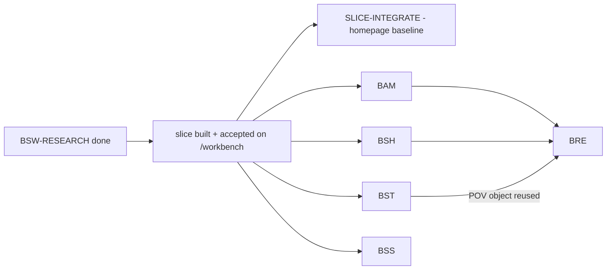

# BSW breadth + integrate — sequencing and the single-editor convergence queue

Authority: `../PROGRAM.md` + the five `BSW-*_CHARTER.md` + each lane's
`dispatch/<CODE>/wave_shape.yml`. This file is the cross-lane plan O0 uses to
dispatch the breadth packets without two lanes ever co-editing a shared file.

`repo_state_verified_against`: origin/main `b983976f6a602b711fb0be984a1c5eee2f57cf75`.

## Dependency DAG

- **BAM** and **BSH** are pure-research-grounded and depend on nothing but the slice; they can run in parallel (disjoint scopes: `infra/acoustic` + `modeling/acoustic` vs `web/lib/scene/hud/spectro` + `web/lib/scene/ocean`).
- **BST** is independent of BAM/BSH at BUILD; **BRE** consumes BAM's richer classification + BSH's timeline authority + BST's POV object, so BRE-BUILD runs after those land (or builds against current contracts and flags the gap).
- **BSS** is independent (annotation studio + tagtools + managed skills); its INTEGRATE touches the console turn, not `SalishScene.tsx`.
- **SLICE-INTEGRATE** mounts the existing thin slice on the homepage; the breadth INTEGRATE waves later re-mount each deepened module in place.

## BUILD waves can run in parallel (disjoint file ownership)

| Lane | BUILD scope (net-new / extend) | Touches a convergence file at BUILD? |
|---|---|---|
| BST | `web/lib/scene/hydrophone/**`, `web/public/hydrophone/**`, `web/app/(sandbox)/station/**` | no |
| BAM | `infra/acoustic/**`, `modeling/acoustic/**` | no |
| BSH | `web/lib/scene/hud/spectro/**`, `web/lib/scene/ocean/**`, `web/public/ocean/**` | no |
| BRE | `web/lib/scene/reenactment/**`, `web/lib/scene/orca/motion/clips/**` | no |
| BSS | `web/app/(workbench)/**`, `infra/tagtools/**`, `src/aws_backend/casting/**`, `docs/devpost/casting/**` | no |

These BUILD scopes are mutually disjoint, so the five BUILD waves are safe to dispatch concurrently. Only INTEGRATE serializes.

## The single-editor convergence queue (one lane at a time)

All of these edit `web/app/components/scene/SalishScene.tsx` (and some also `globals.css`). They are also shared with the other orcast lanes (LGC, CVP, WFX, ORCA, 3D-TWIN), so the queue serializes **across** those too. Exactly one INTEGRATE wave holds the queue at a time; every INTEGRATE does `git pull --rebase` first.

Recommended SalishScene order:
1. **SLICE-INTEGRATE** — mount the thin-but-real slice as the homepage baseline.
2. **BST-INTEGRATE** — station-select -> equipment model + POV object (also `AdaptiveExplore.tsx`, `globals.css`).
3. **BSH-INTEGRATE** — spectrogram HUD + (optional) ocean layer (also `globals.css`; coordinate **WFX** for water).
4. **BRE-INTEGRATE** — multi-orca reenactment + POV (coordinate **ORCA**, shared rig/motion stack).

`BAM` does not edit `SalishScene.tsx` (it serves via `web/public/hydrophone/slice/classification.json`); it only enters the queue if a later wave adds a console readout.

Separate, parallel queue — **console turn** (`AdaptiveExplore.tsx`, `ActiveSurfaceHost.tsx`, `uiIntent.ts`, `globals.css`), shared with **LGC/CVP**:
- **BSS-INTEGRATE** — wire the studio + managed skills into the console. (BST-INTEGRATE also touches `AdaptiveExplore.tsx`/`globals.css`; serialize BST vs BSS on those two files even though their SalishScene work differs.)

## ACCEPT waves

Each lane's ACCEPT runs on the **aimez-gpu-capture (Tesla T4)** host via `infra/render_host/render.sh`, Read-examines frames, and writes an honest verdict + evidence to `dispatch/<CODE>/gate_screenshots/`. Keep any frame-time A/B (BSH, BRE) **serial on the isolated host** — concurrent GL contexts corrupt timing.

## Gates (every lane)

- BUILD: net-new/extend + sandbox only, `tsc`/lint clean, no `next dev/build` in parallel, heavy assets to the box. No convergence edits. No commit.
- INTEGRATE: single editor, `git pull --rebase` first, GATED on O0, serialize across the queues above.
- ACCEPT: real T4 capture, GATED on O0, honest verdict.
- Commit/push is an explicit operator gate, always.

## How O0 dispatches one lane

Background sub-orchestrator with `dispatch/<CODE>/ORCHESTRATOR_DISPATCH_PROMPT.md` as the prompt; it runs that lane's BUILD, then pauses and returns. O0 stays unblocked and reconciles on completion, then approves INTEGRATE/ACCEPT per this queue.
