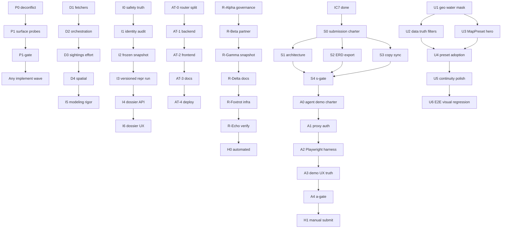

# orcast waves registry

Canonical index for all wave systems. **Status lives here**; [HANDOFF_STATUS.md](../../HANDOFF_STATUS.md) holds live URLs and deploy evidence; [workflow-truth-table.md](workflow-truth-table.md) holds route-level truth labels. **Settled authorial/architectural/claim decisions live in [.cca/STANDING_DECISIONS_REGISTER.md](../../.cca/STANDING_DECISIONS_REGISTER.md) (decision-of-record).**

## Wave types

| Type | Who runs it | When |
|------|-------------|------|
| **Probe** | Readonly subagent panels | Before/after implement waves; hostile review |
| **Implement** | Parallel write lanes | After probe gate passes (or P0 backlog empty) |
| **Verify** | Parent agent + `tools/waves/run-gate.sh` | Between waves; subagents do not self-certify |
| **Deploy** | Human or deploy scripts | After verify gate; updates HANDOFF URLs |

## Naming

Canonical ID: `{Family}-{Wave}`. Historical aliases are preserved in the **Aliases** column.

| Family | Prefix | Type |
|--------|--------|------|
| Probe | `P` | readonly adversarial |
| Remediation | `R` | post-audit implement (Alpha = `R-Alpha`) |
| API truth | `AT` | endpoint/doc honesty |
| Research impl | `I` | workflow alignment (I0–I7) |
| Data wiring | `D` | ingest prerequisite (D1–D4) |
| Map UX | `U` | Angular map truth (U1–U6) |
| Hackathon | `H` | submit gates (H0 auto, H1 manual) |
| Automation | `A` | agent demo Playwright path (A0–A4; post-S4) |
| Submission | `S` | judge-facing materials sync (S0–S4; post-IC7) |
| Managed agents | `M` | Central Casting (M0–M4; user-facing Wave Set H) |
| Interactions casting | `IC` | Grounding pattern + surface planner (IC0–IC7, J0–J2) |
| Exploration | `E` | Aurora guide + dual-DB (E0–E5) |

## Authoritative demo surfaces

| Surface | URL | Use for judges |
|---------|-----|----------------|
| H0 hackathon web | https://orcast-h0.vercel.app | **Primary** — gates, moderation, provenance, partner API |
| Angular pilot maps | https://d2gslju5drx74c.cloudfront.net | Secondary — reports, historical/realtime maps |
| orcast.org | Firebase | **Do not** use as primary Devpost link |

## Dependency graph



## Status matrix (baseline 2026-06-23)

| ID | Family | Status | Gate |
|----|--------|--------|------|
| P0 | P | done | manual — truth table + lanes updated |
| P1 | P | planned | `./tools/waves/run-gate.sh P1-gate` after panels |
| P2 | P | planned | deep probe dossier |
| P3 | P | planned | bugbot + security-review on diff |
| R-Alpha | R | done | pytest governance |
| R-Beta | R | done | partner key 401/200 |
| R-Gamma | R | done | snapshot fit tests |
| R-Delta | R | done | doc grep |
| R-Foxtrot | R | done | CFN + Vercel env |
| R-Echo | R | done | `./tools/waves/run-gate.sh R-echo` |
| R-backlog | R | planned | ModerationRecord table, Stripe |
| AT-0 | AT | done | router split |
| AT-1 | AT | done | `./tools/waves/run-gate.sh AT-1` |
| AT-2 | AT | done | ng test + cypress |
| AT-3 | AT | done | doc grep |
| AT-4 | AT | done | `./tools/waves/run-gate.sh AT-4` |
| I0 | I | done | gates redaction, H0 surface |
| I1 | I | done | WorkOS reviewer stamping |
| I2 | I | partial | `frozen_data` pin; full S3 partition freeze pending |
| I3 | I | partial | repr_id/run_id; full non-overwrite policy partial |
| I4 | I | done | dossier export + PII gate |
| I5 | I | partial | Level 0 artifact; baselines `planned` |
| I6 | I | partial | H0 UX live; partner on Vercel deployed |
| I7 | I | done | truth table + architecture.mmd + drawio PNG export (Wave S1/S2) |
| D1 | D | planned | fetchers + TimeSeriesStore |
| D2 | D | planned | orchestration + backfill |
| D3 | D | planned | live OBIS + iNat + uptime |
| D4 | D | planned | bathymetry L3 |
| U1–U6 | U | planned | see [IMPLEMENTATION_BACKLOG.md](../ux/IMPLEMENTATION_BACKLOG.md) |
| H0 | H | verify on demand | `./tools/waves/run-gate.sh H0` |
| H1 | H | manual | video, DynamoDB screenshot, Devpost |
| SD-H | SD | repo-side done; prod-green pending operator | delete root vercel.json + web/vercel.json + Root Directory=web (see SDR O-1) |
| SD (register) | SD | done | `.cca/STANDING_DECISIONS_REGISTER.md` written + wired; SD assertions in s-doc-grep |

## Full wave catalog

### Probe family (P)

| ID | Aliases | Status | Goal | Scope | Panels | Gate | Blocks |
|----|---------|--------|------|-------|--------|------|--------|
| P0 | deconflict | done | Lane ownership + truth table + live URLs | `workflow-truth-table.md`, `LANE_OWNERSHIP.md` | coordinator | — | P1 |
| P1 | surface probe | planned | Hostile review of prod surfaces | see [ADVERSARIAL_PROBE_PLAYBOOK.md](ADVERSARIAL_PROBE_PLAYBOOK.md) | P1-A…F | `P1-gate` | implement |
| P2 | deep probe | planned | Snapshot replay, ASL, billing, Devpost pack | modeling, ASL, devpost docs | P2-A…D | manual | P3 |
| P3 | diff review | planned | bugbot + security on branch | git diff | bugbot, security-review | manual | deploy |

### Remediation family (R)

| ID | Aliases | Status | Goal | Scope | Gate | Evidence |
|----|---------|--------|------|-------|------|----------|
| R-Alpha | Channel Alpha, T0-alpha | done | Trusted-proxy reviewer auth, DDB conditional moderation | `auth.py`, `community.py`, `web/app/api/be/` | pytest governance | HANDOFF |
| R-Beta | Channel Beta | done | Partner API, rate limits, prefix auth removed | `partner.py`, `web/app/api/v1/` | partner 401/200 | HANDOFF |
| R-Gamma | Channel Gamma | done | Snapshot pin + run_fit from snapshot | `fit_kernels.py`, ASL | fit tests | HANDOFF |
| R-Delta | Channel Delta | done | Doc truth labels | `docs/devpost/*` | doc grep | truth table |
| R-Foxtrot | Channel Foxtrot | done | CFN partner table, seed key, Vercel env | `infra/aws/`, Vercel | deploy | HANDOFF |
| R-Echo | Channel Echo | done | Prod smoke | prod curls | `R-echo` | HANDOFF |
| R-backlog | T4 | planned | ModerationRecord, Stripe tier billing | TBD | — | — |

### API truth family (AT)

| ID | Aliases | Status | Goal | Lanes | Gate |
|----|---------|--------|------|-------|------|
| AT-0 | Wave 0 | done | Router split, `LANE_OWNERSHIP.md` | coordinator | pytest smoke |
| AT-1 | Wave 1 | done | Read truth, write auth, forecast ghost purge | A, B, C | `AT-1` |
| AT-2 | Wave 2 | done | Angular UI labels + backend.service contract | D, E | ng test |
| AT-3 | Wave 3 | done | Docs purge + API.md catalog | F, G | doc grep |
| AT-4 | Wave 4 | done | Deploy + live curl verification | H | `AT-4` |

### Research implementation family (I)

| ID | Status | Goal | Key paths | Gate |
|----|--------|------|-----------|------|
| I0 | done | Safety + truth fixes on gates/public API | `serve.py`, `web/app/gates/` | truth table |
| I1 | done | Identity binding + audit visibility | `auth.py`, `journal.py`, `decisions/` | pytest |
| I2 | partial | Fit plan + frozen snapshot | `fit_kernels.py`, ASL | fit tests |
| I3 | partial | Versioned repr/run manifests | `fit_kernels.py`, S3 keys | fit tests |
| I4 | done | Review dossier API + export | `review_dossier.py`, `web/app/review-dossier/` | pytest dossier |
| I5 | partial | Modeling rigor + baselines | `modeling/`, gates UI | `I-suite` |
| I6 | partial | Dossier UX + partner surface in app | `web/app/*`, `/api/v1` | H0 |
| I7 | done | Diagram + doc sync (Wave S1/S2) | `figures/`, methodology docs | visual verify |

Details: [research-workflow-implementation-waves.md](research-workflow-implementation-waves.md).

### Data wiring family (D)

| ID | Aliases | Status | Goal | Gate |
|----|---------|--------|------|------|
| D1 | DATA_WIRING Wave 1 | planned | Fetchers + TimeSeriesStore + covariates | pytest |
| D2 | Wave 2 | planned | Ingest orchestration + backfill + schedule | deploy + status |
| D3 | Wave 3 | planned | Live OBIS, iNat, station uptime | ingest smoke |
| D4 | Wave 4 | planned | Bathymetry static layer (L3) | asset check |

Details: [DATA_WIRING.md](../methodology/DATA_WIRING.md). **D1–D4 gate all kernel modeling work.**

### Map UX family (U)

| ID | Status | Goal | Gate |
|----|--------|------|------|
| U1 | planned | geo-region util + water mask | unit tests |
| U2 | planned | data-truth filters (sightings/feeds/pods) | map e2e |
| U3 | planned | MapPreset + landing heatmap hero | visual |
| U4 | planned | page preset adoption + themed cards | visual |
| U5 | planned | carry-forward state + mobile + copy | e2e |
| U6 | planned | E2E + visual-regression suite | playwright |

Details: [IMPLEMENTATION_BACKLOG.md](../ux/IMPLEMENTATION_BACKLOG.md).

### Hackathon family (H)

| ID | Status | Goal | Gate |
|----|--------|------|------|
| H0 | verify on demand | Automated pre-submit checks | `./tools/waves/run-gate.sh H0` |
| H1 | manual | Video, DynamoDB screenshot, Devpost publish | human checklist |

Details: [HACKATHON_SUBMIT_CHECKLIST.md](HACKATHON_SUBMIT_CHECKLIST.md).

### Exploration family (E)

| ID | Status | Goal | Gate |
|----|--------|------|------|
| E0 | done | Contract + lane ownership | manual checklist |
| E1 | done | Parallel lanes: infra, store, API, UI, gates | `./tools/waves/run-gate.sh e2` |
| E2 | done | Integrator merge + proxy allowlist | `e2` + `I-suite` |
| E3 | done | Architecture diagram + registry | `e-doc-grep` |
| E4 | done | CFN + App Runner + Vercel deploy | `e-gate` + `H0` |
| E5 | done | Adversarial probes → next objectives | dossier |

Contract: [exploration/CONTRACT.md](exploration/CONTRACT.md).

### Caveat mediation family (F)

| ID | Status | Goal | Gate |
|----|--------|------|------|
| F0 | done | Deep probe dossier | manual |
| F1 | done | Network, rate limits, retention, docs | `./tools/waves/run-gate.sh f` |
| F2 | done | CFN VPC + deploy | `f-gate` + `H0` + `i-suite` |
| F4 | done | Reprobe → G charter | [F4_NEXT_OBJECTIVES.md](exploration/F4_NEXT_OBJECTIVES.md) |

Charter: [exploration/F0_CAVEAT_CHARTER.md](exploration/F0_CAVEAT_CHARTER.md).

### Feature family (G) — done

| ID | Status | Goal |
|----|--------|------|
| G1 | done | Vercel AI Gateway + model picker (`/api/explore`) |
| G2 | done | Explore ↔ map viewport deep links |
| G3 | done | [adversarial-findings-2026-06.md](adversarial-findings-2026-06.md) |
| G4 | done | [G4_DATA_WIRING_STATUS.md](G4_DATA_WIRING_STATUS.md) |

### Managed agents family (M) — Wave Set H

| ID | Status | Goal | Gate |
|----|--------|------|------|
| M0 | done | Terrain dossier + contract | manual |
| M1 | done | Parallel lanes: infra, registry, runtime, skills, gates | `./tools/waves/run-gate.sh m` |
| M2 | done | Integrator merge + proxy allowlist | `m` |
| M3 | done | CFN + seed `explore-guide-v1` | `./tools/waves/run-gate.sh m-gate` |
| M4 | done | Reprobe → Wave I charter | [M4_NEXT_OBJECTIVES.md](casting/M4_NEXT_OBJECTIVES.md) |

Contract: [casting/MANAGED_AGENTS_CONTRACT.md](casting/MANAGED_AGENTS_CONTRACT.md).

### Interactions casting family (IC) — Wave Set IC

| ID | Status | Goal | Gate |
|----|--------|------|------|
| IC0 | done | Step-log synthesis + grounding pattern + skill catalog docs | `ic-doc-grep` |
| IC1 | done | Migration 004 + `steps[]` persistence + API response | `./tools/waves/run-gate.sh ic` |
| IC2 | done | Manifest-driven skills + T0/T1 expansion | `ic` |
| IC3 | done | Inline hydration + ExploreGuidePanel trace UI + Vercel Gateway route | `./tools/waves/run-gate.sh ic` |
| IC4 | done | G5 remediation: gates CV caution, API.md truth, Angular badges | `./tools/waves/run-gate.sh ic4` |
| IC5 | done | Vercel redeploy + prod smoke | `ic-gate` |
| J0 | done | Surface planner charter + UI intent schema | `ic6-doc-grep` |
| IC6 | done | Keyed `/plan` + surface-planner-v1 + panel registry | `./tools/waves/run-gate.sh ic6` |
| J1 | done | T2/T3 skills + dossier-explainer + promotion-clerk seeds | `ic6` |
| J2 | done | ActiveSurfaceHost + uiIntent on `/explore` | `ic6` |
| IC7 | done | App Runner + H0 deploy + ic6-gate | `./tools/waves/run-gate.sh ic6-gate` |

Pattern: [casting/INTERACTIONS_GROUNDING_PATTERN.md](casting/INTERACTIONS_GROUNDING_PATTERN.md). Catalog: [casting/SKILL_CATALOG.md](casting/SKILL_CATALOG.md).

Wave Set IC (IC0–IC7) complete. Wave Set **S** complete (S0–S4). Wave Set **A** complete (A0–A5). Wave Set **W** in progress (W0–W7). **Next: W1** build pipeline.

### Whitepaper family (W) — Wave Set W

| ID | Status | Goal | Gate |
|----|--------|------|------|
| W0 | done | Charter + caveat table + registry | manual — [whitepaper/W0_WHITEPAPER_CHARTER.md](../whitepaper/W0_WHITEPAPER_CHARTER.md) |
| W1 | in_progress | Folder scaffold + LaTeX root + Makefile | file check |
| W2 | pending | reference_audit.py + references.bib | `make audit` |
| W3 | pending | Prose MD + LX/Sections/ (prose gates PG-1..6) | prose gate review |
| W4 | pending | Equations.tex + Glossary_Content.tex | `make pdf` compile check |
| W5 | pending | Mermaid figures + Appendix_Diagrams.tex | visual verify each PDF |
| W6 | done | `make pdf` + visual verify full PDF — 560KB, 0 undefined refs | visual verify |
| W7 | done | Next-phase charter (IC8, W-Eval, W-RAG, P1) | [W7_NEXT_PHASE_CHARTER.md](../whitepaper/W7_NEXT_PHASE_CHARTER.md) |

Wave Set W complete (W0–W7). H1 manual submit ready. See [whitepaper/W0_WHITEPAPER_CHARTER.md](../whitepaper/W0_WHITEPAPER_CHARTER.md) and [whitepaper/Build/Raitses_orcast_2026.pdf](../whitepaper/Build/Raitses_orcast_2026.pdf).

### Automation family (A) — Wave Set A

| ID | Status | Goal | Gate |
|----|--------|------|------|
| A0 | done | Charter + caveat table | manual — [submission/A0_AGENT_DEMO_CHARTER.md](submission/A0_AGENT_DEMO_CHARTER.md) |
| A1 | done | Proxy auth unify (`agentAuth`, plan + be routes) | `agent_smoke.py` |
| A2 | done | Playwright demo harness + DEMO_NO_CRED storyboard | `h1-demo` |
| A3 | done | AuthStatus automation chip + planner agent id | visual |
| A4 | done | Auth/API composite gate | `./tools/waves/run-gate.sh a-gate` (partial) |
| A5 | done | Video-complete: maps + content waits + webm | `./tools/waves/run-gate.sh a-gate` |

H1 manual submit depends on A4. See [DEMO_NO_CRED_STORYBOARD.md](DEMO_NO_CRED_STORYBOARD.md) and [tools/testing/AGENT_USER.md](../../tools/testing/AGENT_USER.md).

### Submission family (S) — Wave Set S

| ID | Status | Goal | Gate |
|----|--------|------|------|
| S0 | done | Charter + truth audit | manual — [submission/S0_SUBMISSION_SYNC_CHARTER.md](submission/S0_SUBMISSION_SYNC_CHARTER.md) |
| S1 | done | Architecture diagram (Casting, 9 DDB tables, Gateway) | visual + grep |
| S2 | done | ERD drawio re-export pages 1–5 | visual |
| S3 | done | SUBMISSION / DEVPOST / storyboard sync | `s-doc-grep` |
| S4 | done | Submission gate | `./tools/waves/run-gate.sh s-gate` |

H1 manual submit depends on S4. See [HACKATHON_SUBMIT_CHECKLIST.md](HACKATHON_SUBMIT_CHECKLIST.md).

**Note:** H1 also requires A4 `a-gate` PASS (Wave Set A) before demo video recording.

### Cleanup family (P2X) — Wave Set P2X

| ID | Status | Goal | Gate |
|----|--------|------|------|
| P2X | done | Clear P2 residue from the 2026-06-26 adversarial wave (claim/number, deploy hygiene, figure/citation consistency) via discovery→classification→remediation→adversarial loop | visual verify + adversarial CLEAN |

Charter: [.cca/P2X_CLEANUP_CHARTER.md](../../.cca/P2X_CLEANUP_CHARTER.md). Register: [.cca/P2X_DEFECT_REGISTER.md](../../.cca/P2X_DEFECT_REGISTER.md). All four WP PDFs rebuilt (10/7/5/4); fig-1 + fig-3 re-exported and visually verified; both repos pushed.

## Gate command reference

```bash
# From repo root
./tools/waves/run-gate.sh H0        # hackathon automated
./tools/waves/run-gate.sh P1-gate   # doc grep + prod curls (post-probe)
./tools/waves/run-gate.sh I-suite   # pytest aws_backend + modeling
./tools/waves/run-gate.sh AT-4      # backend smoke + angular build
./tools/waves/run-gate.sh R-echo    # remediation prod verification
./tools/waves/run-gate.sh e2        # exploration local (pytest + tsc)
./tools/waves/run-gate.sh e-gate    # exploration prod smoke
./tools/waves/run-gate.sh e-doc-grep
./tools/waves/run-gate.sh f
./tools/waves/run-gate.sh f-gate
./tools/waves/run-gate.sh g
./tools/waves/run-gate.sh g-gate
./tools/waves/run-gate.sh m
./tools/waves/run-gate.sh m-gate
./tools/waves/run-gate.sh ic
./tools/waves/run-gate.sh ic-doc-grep
./tools/waves/run-gate.sh ic6
./tools/waves/run-gate.sh ic6-doc-grep
./tools/waves/run-gate.sh ic6-gate
./tools/waves/run-gate.sh s-doc-grep
./tools/waves/run-gate.sh s-gate
./tools/waves/run-gate.sh a-doc-grep
./tools/waves/run-gate.sh a-gate
./tools/waves/run-gate.sh h1-demo
```

See [tools/waves/README.md](../../tools/waves/README.md) for script mapping.

## Related documents

- [H0_WORKSHOP_COMPLIANCE.md](H0_WORKSHOP_COMPLIANCE.md) — grade execution vs Vercel × AWS workshop scope
- [ADVERSARIAL_PROBE_PLAYBOOK.md](ADVERSARIAL_PROBE_PLAYBOOK.md) — P0–P3 panel prompts
- [waves.registry.yaml](waves.registry.yaml) — machine-readable index
- [infra/aws/state/LANE_OWNERSHIP.md](../../infra/aws/state/LANE_OWNERSHIP.md) — file ownership
- [research-workflow-alignment-charter.md](research-workflow-alignment-charter.md) — probe output template

## Quarantine rule

Paths under `archive/quarantine/**` are **out of scope** for implement lanes and probe panels unless explicitly assigned. Legacy agent demos and July 2025 presentation deck live there.
