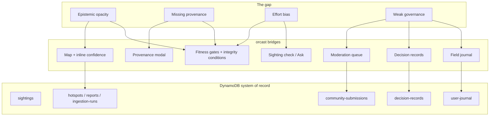

# Whitepaper hypothesis: the gap orcast bridges

**Working title:** Evidence-bounded encounter forecasting for effort-biased wildlife observation  
**Platform:** [orcast](https://orcast-h0.vercel.app) — Salish Sea pilot (Haro Strait acoustic station)  
**Status:** pilot deployment, June 2026

---

## Abstract

Wildlife encounter forecasts are usually presented as smooth maps with implicit certainty. Observers, stewards, and researchers cannot tell whether a “hotspot” reflects animal behavior, human search effort, detector false positives, or model overfitting. **orcast** tests a different contract: the forecast is always visible, but its displayed confidence is bounded by automated statistical gates, explicit integrity conditions, provenance traces, quarantined citizen reports, and human promotion decisions — all persisted in Amazon DynamoDB with an auditable chain from map cell to source record.

This document states the **hypothesis** the platform is built to test, the **gap** it bridges, and the **falsifiable claims** a reviewer or field partner should use to judge success.

---

## 1. The gap

Four failures overlap in today’s encounter-forecast stack:

| Failure | What users experience | Why it matters |
|--------|------------------------|----------------|
| **Epistemic gap** | A map shows intensity without saying what evidence earned it | Shore and kayak observers over-trust or dismiss forecasts equally |
| **Provenance gap** | No drill-down from a prediction to kernels, detections, and gate verdicts | Scientists cannot audit or reproduce a public-facing claim |
| **Effort gap** | Sightings and acoustic hits conflate “animals present” with “people or hydrophones looking” | Hotspots mirror observer density, not ecology |
| **Governance gap** | Citizen reports and model promotions enter the narrative without quarantine or signed human authority | Bad data and overconfident automation compound silently |

Existing tools address pieces of this (e.g. acoustic review UIs, static methodology PDFs, moderation spreadsheets). None combine **live forecast + gate battery + per-cell provenance + quarantined community ingest + immutable promotion audit** in one operational loop backed by a primary transactional database.

---

## 2. Core hypothesis

> **H1:** For effort-biased, sparsely validated encounter data, a forecast that (a) caps displayed confidence by an explicit gate policy, (b) exposes integrity conditions alongside every confidence-bearing surface, and (c) separates automated eligibility from human promotion authority will **reduce false certainty** without hiding the forecast entirely — and will **increase steward trust** compared to a conventional confidence-smoothed map.

**Corollaries (testable in the pilot):**

1. **Gate honesty:** When gates fail (e.g. in-sample time-rescaling, marginal cross-validation, excluded covariates), effective confidence stays low and integrity conditions are visible — not buried in a methods appendix.
2. **Provenance usability:** A user can move from map cell → kernel contributions → nearby evidence sample in one session without AWS console access.
3. **Community safety:** Shore submissions remain in a moderation queue until a signed-in reviewer approves; approval stamps attribution and low reliability weight before influence.
4. **Sighting separation:** A conversational “was that an orca?” check (Bedrock-assisted, gates-grounded) distinguishes **encounter likelihood from the temporal model** from **verification of an individual observation** — and routes uncertain cases to the moderation path instead of a false yes/no.
5. **Field continuity:** A private field journal can hold observations and selectively publish to the community queue without merging private notes into the public model by default.

If any corollary fails in production (e.g. confidence rises without promotion, provenance omits failed gates, or citizen data bypasses moderation), **H1 is weakened** for that deployment.

---

## 3. What orcast bridges (platform layers)

| Layer | Route | Gap bridged |
|-------|-------|-------------|
| Public forecast | `/` | Always-on map with effective confidence meter |
| Provenance | map click | Epistemic + provenance |
| Gates + glossary | `/gates`, `/glossary` | Gate policy + plain-language integrity conditions |
| Sighting check | `/ask` | Separates model timing from observation verification |
| Field journal | `/journal` | Private notes → optional publish to moderation |
| Moderation | `/moderation` | Governance for citizen science |
| Review dossier / decisions | `/review-dossier/latest`, `/decisions` | Human promotion audit trail |
| Orchestrator | Step Functions + fit Lambda | Reproducible ingest → fit → gate → human step |

**Architecture:** Next.js on Vercel → server-side proxy → FastAPI on App Runner → **nine DynamoDB tables** (primary) + S3 artifacts. Reviewer actions require WorkOS AuthKit; public forecast and gates stay open.

---

## 4. Design principles (non‑negotiables)

1. **Show the forecast; bound the confidence.** Hiding the map until “ready” swaps one failure mode for another.
2. **Integrity conditions, not silent caveats.** Scope limits (single station, unreviewed acoustic candidates, excluded tide/season) appear on gates, provenance, and sighting-check replies.
3. **Automated gates ≠ promotion.** Gates compute eligibility; a human signs off before displayed confidence is promoted (`decision-records` table).
4. **Citizen data is quarantined by default.** Approve → attribution + low weight; reject → audit only.
5. **LLM narration is grounded.** Sighting check uses Bedrock only with live gate/provenance context; template fallback if unavailable.
6. **Single system of record.** DynamoDB holds operational entities; S3 holds time-series and fit artifacts.

---

## 5. Pilot scope and known limits

The current fit is **partial by construction** (see `model-card-lite.md`):

- One acoustic station (~7.5 months), OrcaHello/Orcasound candidates largely unreviewed at Level 0.
- Diel + lunar fitted; tide/season excluded when data overlap or annual coverage fails gates.
- Spatial forecast is temporal intensity with spatial metadata — not a full spatial kernel fit.
- Effective confidence is **0% promoted** until a reviewer records a promotion decision.

These limits are **features of the honesty model**, not bugs to hide before submission. They define where H1 applies today versus where it must be retested after multi-station ingest and Level 0 QC integration.

### 5a. Ratified capabilities, limits, risks, and future directions

The platform's full limit and risk profile is ratified in the tracked-limits register (`.sst/tracked_limits_register_v1.json`, decision `orcast_tracked_limits_register_v1_20260628`), which marks each limit **unsurmountable for the submission window** (a scientific or scope limit) or **surmountable** (an owned fix path deferred by the window or an operator gate).

- **Capabilities today:** the gated forecast, per-cell provenance, the fitness gates with integrity conditions, the exploration guide and surface planner, the sighting check, the field journal, citizen-science moderation, the human-promotion audit log, hydrophone-detection annotation, and a modeled 3D twin in the research sandbox.
- **Unsurmountable for the window:** single sparse acoustic station and unreviewed detections (TL-01, TL-02), effort-biased sightings (TL-03), an honest 0% promoted confidence (TL-04), the pilot spatial scope (TL-05), the twin as a modeled sandbox surface (TL-07), and the B-side dtag and full-annotation tools as direction (TL-08).
- **Surmountable:** excluded covariates (TL-06), the unshipped orchestration console (TL-09), SES sandbox (TL-10), the absence of a warm rollback while the cold-start gap itself is closed (TL-11), ONC disabled pending validation (TL-13), and the undeployed twin route (TL-14).
- **Future directions:** multi-station acoustic relay with reviewed labels, effort correction and added covariates re-run through the same gates, a shipped twin research route, the B-side workbench, and the managed-orchestration bridge. These align with the extension path in section 6.

---

## 6. How to falsify or extend the hypothesis

| Observation | Interpretation |
|-------------|----------------|
| Users ignore gates and trust the map anyway | UX or wording failure; H1 not yet tested fairly |
| Reviewers promote without reading dossier | Governance gap persists; need stronger dossier workflow |
| Moderation queue backs up; reports dropped | Operational failure of governance bridge |
| Sighting check gives false verification | LLM layer violated principle 5; revert to template-only |
| New covariates pass gates but CV skill ≤ 0 | Gate policy correctly withholds confidence — extend H1 to multi-covariate pilot |

**Extension path:** add stations, reviewed OrcaHello labels, effort covariates, spatial kernels — re-run the same gate battery and compare whether effective confidence moves only when gates and humans agree.

---

## 7. Relation to hackathon submission

For **H0: Hack the Zero Stack**, orcast demonstrates that DynamoDB can anchor the full loop — sightings, moderation, decisions, journal, hotspots, reports, ingestion runs — while Vercel serves a public surface that never exposes API keys and WorkOS gates reviewer authority.

The demo video should show: problem → live map → provenance → gates (with integrity conditions) → sign-in → moderation → DynamoDB console (nine tables) → optional `/ask` and `/journal` beats.

Copy-paste fields: `DEVPOST_DRAFT.md`. Video script: `DEMO_STORYBOARD.md`.

---

## 8. One-sentence pitch

**orcast** bridges the gap between “a forecast you can use in the field” and “a forecast you can defend in public” — by making confidence, provenance, and human authority part of the product, not the footnotes.
