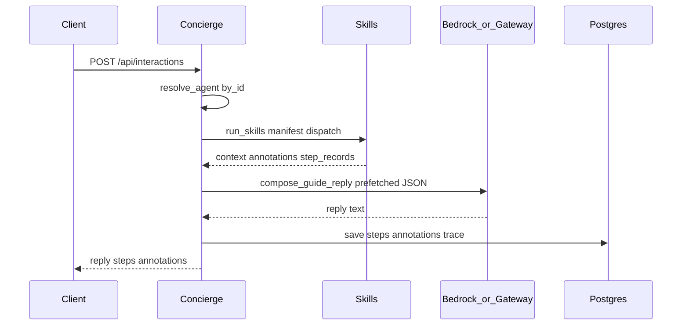

# Interactions grounding pattern (ORCAST-native)

Extends [`MANAGED_AGENTS_CONTRACT.md`](MANAGED_AGENTS_CONTRACT.md). Maps external “Interactions API + geo tool grounding” patterns to ORCAST Central Casting **without** Google Maps, Gemini, or Vertex.

## Design principle

**Prepare-then-narrate:** Concierge runs allow-listed skills deterministically, persists structured steps, then LLM narrates JSON context only. The model does not choose which backend tools to call on public `/api/interactions`.

## Google → ORCAST mapping

| External pattern | ORCAST equivalent |
|------------------|-------------------|
| `tools: [{ type: "google_maps", latitude, longitude }]` | `skills[]` on cast role + `viewport` on `POST /api/interactions` |
| Dynamic model tool invocation | [`run_skills`](../../../src/aws_backend/casting/skills.py) + [`skills_manifest.json`](../../../src/aws_backend/casting/skills_manifest.json) |
| `interaction.steps` | `interaction_steps` JSONB (migration `004`) + response `steps[]` |
| `place_citation` | `gate_citation`, `provenance_citation`, `artifact_citation`, `deep_link` |
| Show sources under answer | Response `annotations[]`; UI renders in Wave IC3 |
| Tool off by default | Agent `skills[]` explicit; geo skills skipped without viewport |

## Interaction pipeline



## Step schema

Each interaction produces an ordered `steps[]` array:

| `type` | Purpose |
|--------|---------|
| `resolve_agent` | Cast role id, version, `resolved_spec_hash` |
| `skill_invocation` | One row per skill run with input, status, duration, grounding refs |
| `policy_check` | Deep-link filter, tier validation (optional) |
| `plan_output` | Keyed planner skill_plan + panel ids (IC6/J) |
| `model_output` | Provider, model, text preview, `annotations[]` |

Example:

```json
{
  "interaction_id": "uuid",
  "steps": [
    {
      "type": "resolve_agent",
      "managed_agent_id": "explore-guide-v1",
      "agent_version": "1.0.0",
      "resolved_spec_hash": "ff2185b4..."
    },
    {
      "type": "skill_invocation",
      "skill": "fetch_gates",
      "input": {},
      "output_status": "success",
      "duration_ms": 12,
      "grounding_refs": ["repr:level1_psth"]
    },
    {
      "type": "model_output",
      "provider": "bedrock",
      "model": "global.anthropic.claude-haiku-4-5-20251001-v1:0",
      "annotations": [
        {
          "type": "gate_citation",
          "label": "Fitness gates",
          "href": "/gates",
          "artifact": { "repr_id": "repr_...", "run_id": "run_..." }
        }
      ]
    }
  ]
}
```

## Annotation types

| Type | When | Required fields |
|------|------|-----------------|
| `gate_citation` | `fetch_gates` returned data | `label`, `href`, optional `artifact` |
| `provenance_citation` | pin skills succeeded | `label`, `href`, `lat`, `lng` |
| `artifact_citation` | fit report ids present | `label`, `artifact` |
| `deep_link` | policy-allowed nav link | `label`, `href` |
| `decision_citation` | `fetch_decision_records` succeeded | `label`, `href` |
| `evidence_citation` | sightings/events skills | `label`, `href` or `source` |

## Geo routing rules

Equivalent to “local queries use coordinates”:

1. Resolve pin from `viewport.lat/lng` or `focus.cell`.
2. If pin present → run T1 skills in agent spec (`fetch_provenance`, `fetch_forecast_cell`).
3. If no pin → run T0 regional skills (`fetch_hotspots`, `fetch_gates`, …).
4. Never synthesize coordinates; skip T1 skills when geo missing.
5. Manifest `geo_required: true` skills are skipped (not errored) when no pin.

## Attribution rules (ORCAST-native)

1. When any skill returns `output_status: success`, `model_output.annotations` must be non-empty.
2. Provenance/forecast replies must preserve anti-oracle disclaimer from cast `instructions`.
3. Deep links filtered by `policy.allowed_deep_links` in [`policy.py`](../../../src/aws_backend/casting/policy.py).
4. UI (IC3) renders annotations immediately below reply text.

## Auth tiers and public interactions

Public `POST /api/interactions` accepts **T0 and T1** skills only. T2/T3 skills require keyed routes or future cast roles invoked by Step Functions.

## Persistence

| Store | Fields |
|-------|--------|
| Postgres `exploration_turns` | migration `003` trace columns + `interaction_steps JSONB` (`004`) |
| Response body | `steps`, `annotations`, existing turn fields |

## Related docs

- [`SKILL_CATALOG.md`](SKILL_CATALOG.md) — human skill index
- [`skills_manifest.json`](../../../src/aws_backend/casting/skills_manifest.json) — machine catalog
- [`IC0_STEP_LOG_SYNTHESIS.md`](IC0_STEP_LOG_SYNTHESIS.md) — synthesis source
