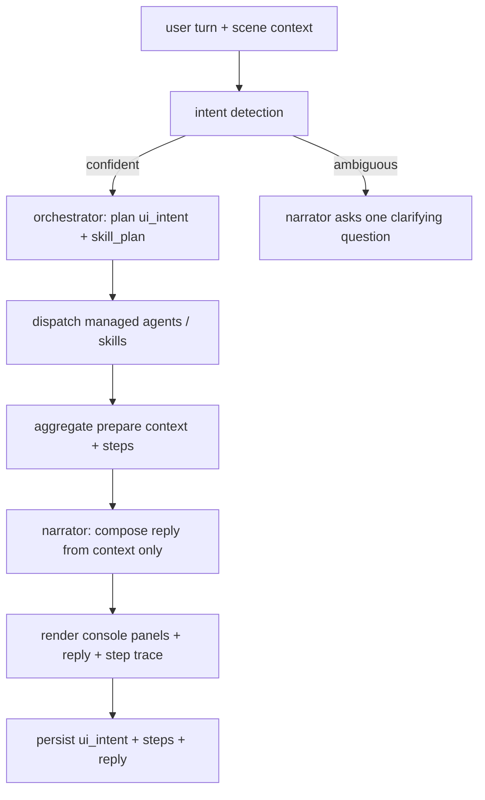

# Orchestrator <-> Narrator Alignment Framework

How the planning **orchestrator** (deterministic surface planner + skill dispatch) and the user-facing **narrator** (chat LLM) coordinate so the explore experience stays grounded, durable, and aligned with the orcast claim canon. This is the contract the adaptive console is built against (see the plan `explore_3d_narrator`).

Relationship to canon: this realizes SD-001 (orchestrator-in-the-loop framing) and is bounded by [.cca/CLAIM_BOUNDARIES.md](../../../.cca/CLAIM_BOUNDARIES.md) and the prepare-then-narrate rule in [INTERACTIONS_GROUNDING_PATTERN.md](INTERACTIONS_GROUNDING_PATTERN.md). It does not introduce a new claim; it constrains how turns are produced.

## 1. Roles and boundary

| Concern | Owner | Rule |
|---------|-------|------|
| WHICH skills run and WHICH console panels open | Orchestrator (`draft_ui_intent` + `validate_ui_intent` + `run_skills`) | Deterministic, auditable; emits `ui_intent.panels` + `skill_plan` + `steps[]` |
| HOW results are explained in prose | Narrator (Bedrock / Vercel AI Gateway) | May cite ONLY the `prepare` context / tool JSON the orchestrator grounded; no free-floating claims |
| WHAT is true (values, forbidden claims) | `CLAIM_BOUNDARIES.md` + Standing Decisions Register | Both orchestrator and narrator are subordinate to canon |

The narrator never selects tools or invents panels. The orchestrator never writes prose. This separation is the durability mechanism: the grounded layer is replayable; the language layer is disposable.

## 2. Turn lifecycle (the loop)

One round-trip per turn via `/api/interactions/plan` with `narrate: true` (plan + dispatch + narrate). No manual planner flag.

## 3. Intent detection drives invocation
- Each turn classifies user intent (from message + scene signals: selected cell, hydrophone, camera target, hovered affordance) into a panel/skill plan.
- Confident intent -> orchestrator plans and dispatches.
- Ambiguous or under-specified intent -> the narrator asks exactly one clarifying question rather than guessing or fabricating a plan. The clarifying turn is itself logged.
- Scene interactions are first-class intent inputs: clicking a hydrophone beacon implies "open `hydrophone_signal` for this station."

## 4. Alignment guardrails
- The narrator may reference only entities present in `prepare.context` / `annotations` / tool outputs for that turn. If asked for something the orchestrator did not ground, it degrades to "I can show X / that needs Y" instead of inventing.
- The narrator may not assert any value or capability outside `CLAIM_BOUNDARIES.md` (e.g. no "predicts whale locations", no "high accuracy"). On a boundary risk it states the honest, gate-bounded answer.
- Panels the user cannot access (keyed T2/T3 skills for anonymous users) are simply omitted by the orchestrator; the narrator explains the sign-in path rather than pretending the data is shown (see anonymous-first access model).
- Mismatch between planned panels and narrated claims is a defect: the trace (`steps[]`) is the source of truth for review.

## 5. Durability / replay
- Every turn persists `ui_intent`, `steps[]`, and the reply (the plan-route persistence fix). This gives multi-turn history and post-hoc replay/inspection.
- `resolved_spec_hash` + `agent_version` pin the exact cast spec used, so a turn is reproducible.
- The visible step log (`resolve_agent -> plan_output -> skill_invocation x N -> model_output`) is both the user-facing "orchestrator-in-the-loop" artifact and the audit record.

## 6. Failure / degradation ladder
1. Skill error -> orchestrator records `output_status: error` in the step; narrator reports the gap honestly, still renders the panels that succeeded.
2. Narrator (LLM) unavailable -> fall back to template narration over the same grounded context; panels still render.
3. Orchestrator planning empty -> narrator asks a clarifying question; no panels forced.
4. Permission gap on an action -> ghosted action + tooltip auth link; no fabricated success.

## 7. Schema references
- `ui_intent` + panel registry: [UI_INTENT_SCHEMA.md](UI_INTENT_SCHEMA.md), `src/aws_backend/casting/panel_registry.json`, [web/lib/uiIntent.ts](../../../web/lib/uiIntent.ts).
- Step log + grounding: [INTERACTIONS_GROUNDING_PATTERN.md](INTERACTIONS_GROUNDING_PATTERN.md), `src/aws_backend/casting/skills.py`.
- Managed agents: [MANAGED_AGENTS_CONTRACT.md](MANAGED_AGENTS_CONTRACT.md), `src/aws_backend/casting/seeds/*.json`.

## 8. Out of scope (P2)
True multi-agent meta-orchestration (per-turn routing among `explore-guide-v1` / `dossier-explainer-v1` / `promotion-clerk-v1` + re-plan) and a model-driven planner replacing the keyword `draft_ui_intent` are deferred per [IC8_NEXT_OBJECTIVES.md](IC8_NEXT_OBJECTIVES.md). This framework is forward-compatible with both: the role boundary and durability rules do not change when planning becomes multi-agent.
