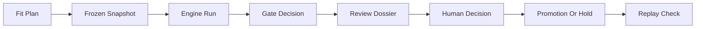

# ORCAST Target Research Workflow

## Canonical Workflow

The target ORCAST research workflow is:



## Authority Model

| Layer | Producer | Authority |
| --- | --- | --- |
| Fit plan | System / maintainer before fit | Declares what will be fit and gated |
| Frozen snapshot | System | Defines exact input data |
| Engine run | Fit Lambda / modeling code | Produces coefficients, fit report, gates |
| Gate decision | Automated policy | Determines confidence and promotion eligibility |
| Supervisor draft | Deterministic or Bedrock supervisor | Advisory only |
| Human decision | Authenticated reviewer | Binding promotion, hold, or reject decision |
| Promotion marker | Server after accepted human decision | Controls displayed effective confidence |
| Replay check | System / audit tool | Verifies artifact chain after the fact |

Automated gates never impersonate a reviewer. Human review never changes gate math. A reviewer only decides whether earned confidence should be promoted, held, or rejected.

## Persistence Contract

### Content-Addressed IDs

All target IDs use canonical JSON and SHA-256:

| ID | Prefix | Hash input | Purpose |
| --- | --- | --- | --- |
| `snap_id` | `snap_` | `snapshot_manifest.json` | Frozen fit inputs |
| `repr_id` | `repr_` | model representation and coefficients | Fitted representation |
| `run_id` | `run_` | fit run manifest | Engine execution |
| `dec_id` | `dec_` | decision artifact | Automated or human decision |
| `f_map_id` | `fmap_` | `{repr_id, run_id, dec_id}` | Materialized DecisionDB edge |

`run_id` is not the same as `ingest_run_id`. Ingestion runs stay as `ingest_*`; engine runs reference one snapshot plus optional contributing ingestion runs.

### Required Artifacts

| Artifact | Target path | Required fields |
| --- | --- | --- |
| `fit_plan.json` | `fit_plans/{plan_hash}/fit_plan.json` | planned covariates, exclusions, baselines, gates, thresholds, splits, seeds |
| `snapshot_manifest.json` | `snapshots/{snap_id}/manifest.json` | time window, stream keys, hashes, S3 versions, ingestion run IDs |
| `representation.json` | `representations/{repr_id}/representation.json` | model family, covariates fit, coefficients hash, excluded covariates |
| `fitted_kernels.json` | `representations/{repr_id}/fitted_kernels.json` | serveable coefficients |
| `fit_report.json` | `runs/{run_id}/fit_report.json` | gates, confidence, caveats, data inventory, metrics |
| `fit_run_manifest.json` | `runs/{run_id}/manifest.json` | `snap_id`, `repr_id`, code digest, data window, output hashes |
| `gate_decision.json` | `runs/{run_id}/gate_decision.json` | automated recommendation, cited gates, gate summary |
| `decision.json` | `decisions/{dec_id}/decision.json` | human verdict, reviewer identity, reason, memo fields |
| `f_map` entry | `f_map/{f_map_id}.json` | `repr_id`, `run_id`, `dec_id`, verdict, promotion URI |
| `current.json` | `models/current.json` | pointer to current `repr_id`, `run_id`, optional `f_map_id` |

Fixed keys such as `models/fitted_kernels.json` and `models/fit_report.json` should become compatibility pointers or copies only. New workflow state should use versioned paths.

### Code Digest

Every `fit_run_manifest.json` should include:

```json
{
  "git_sha": "<commit or dirty marker>",
  "image_digest": "<ECR image sha256 when available>",
  "python": "3.12.x",
  "deps_digest": "sha256:<lockfile hash>",
  "fit_entrypoint": "modeling.fit_kernels.run_fit"
}
```

### Data Window

Every fit, decision, and dossier should carry:

```json
{
  "start": "<ISO8601>",
  "end": "<ISO8601>",
  "bin_hours": 1.0,
  "timezone": "UTC",
  "streams": {
    "acoustic_detections": ["..."],
    "station_uptime": ["..."],
    "env_currents": ["..."]
  }
}
```

## Gate And Promotion Policy

### Serving

ORCAST should serve broad forecasts by default, but confidence and sharpness must reflect evidence.

| Fit state | Serve coefficients? | Display state |
| --- | --- | --- |
| `not_fitted` | No | 0% confidence, not fitted |
| `insufficient_data` | No | 0% confidence, insufficient data |
| `fitted`, confidence below threshold | Yes | raw confidence, unpromoted |
| `fitted`, eligible and human promoted | Yes | promoted effective confidence |

### Promotion Eligibility

The automated path may open human review only when:

- Fit status is `fitted`.
- Confidence is at or above the configured threshold.
- Core gates and caveats are available to the reviewer.

The supervisor recommendation is advisory. A human decision record is required before `promotion.json` can affect displayed confidence.

### Hold Conditions

Default to hold when:

- Data is insufficient.
- Confidence is below the configured threshold.
- Core gates fail.
- Task token times out.
- Reviewer selects `hold` or `reject`.

`hold` should be available in UI, not only API.

### Required Honesty Surfaces

Confidence-bearing UI and exports must include:

- Promotion badge: `human-promoted` or `unpromoted`.
- Server-derived caveats.
- Data inventory and excluded covariates.
- Gate pass/fail details.
- Whether detections are unreviewed candidates.
- Whether effort was assumed continuous.
- Whether validation is single-station or multi-station.

## Replay Contract

Replay check should:

1. Re-hash the snapshot manifest and listed input objects.
2. Re-hash the representation and coefficients.
3. Re-run the fit against frozen snapshot inputs using the stamped fit plan.
4. Compare coefficients and gate summaries within documented tolerance.
5. Validate the promotion chain: `f_map_id -> dec_id -> run_id -> repr_id -> snap_id`.
6. Write `runs/{run_id}/replay_check.json`.

Minimum demo-critical replay can start with snapshot and artifact hash checks before full refit.
