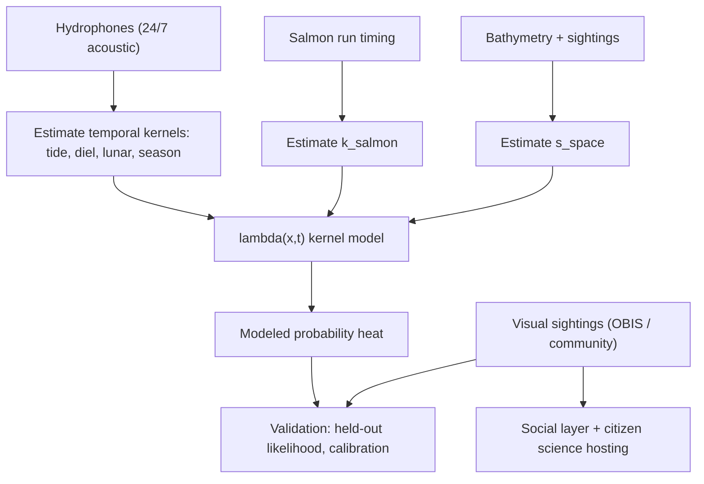

# Forecast kernels: a kernel-based encounter-probability model

Design for making the map heat a **modeled probability surface** built from environmental and temporal kernels (tide, salmon run, diurnal, lunar, seasonal/solar) estimated from data, with reported sightings repositioned to **validation, social, and citizen-science** roles.

Status: design / study program. Nothing here is fitted yet. This document defines the model, the studies to estimate it, the honesty constraints, and a phased build. It is the methodology counterpart to [../ml/ORCA_ML_INTEGRATION.md](../ml/ORCA_ML_INTEGRATION.md).

## The core idea

Today the heat comes from either a synthetic `forecast/spatial` grid (uniform, not meaningful) or, on the landing hero, a density of recent detections (honest but just "where we happened to detect"). Neither is a forecast.

The proposal: model the expected orca encounter rate as a product of slow, interpretable kernels over environmental/temporal covariates, estimate each kernel's shape from data, and render that as the heat. Sightings then stop being the heat and become the thing that **validates** the model and the **community/citizen-science** contribution that feeds estimation.

## The honesty constraint (read first)

A kernel surface that is not yet estimated and validated is fabricated precision — the exact failure we removed elsewhere. Therefore:

1. Do not render a kernel-based heat as the default until it beats a baseline on held-out data.
2. Until then, any modeled surface is labeled "modeled from priors, not yet fit to local data — calibration pending," and shown as an explicitly experimental layer, not the hero default.
3. The real-detection heat (already shipped) remains the honest default until the model earns its place.

## Model form

Model the expected encounter intensity at location `x` and time `t` as a log-linear (Poisson point-process) product of a spatial habitat term and separable temporal/environmental kernels:

```
log lambda(x, t) = b0
                 + s_space(x)                  # habitat / bathymetry / channel prior
                 + k_tide(tidePhase(x, t))     # tidal phase / current state
                 + k_diel(hourAngle(t))        # diurnal
                 + k_lunar(moonPhase(t))       # lunar (~29.5 d)
                 + k_season(dayOfYear(t))      # solar/seasonal daylight + annual cycle
                 + k_salmon(runIndex(t))       # prey availability (salmon run timing)
                 + log E(x, t)                 # observation effort / detection offset
```

- Product in rate space = sum in log space, so kernels are additive and separately interpretable.
- Each `k_*` is a smooth cyclic function (periodic spline / Fourier basis) of its covariate, except `k_salmon` and `s_space` which are aperiodic smooths.
- `lambda` is converted to a 0-1 encounter probability per cell/time for display (e.g., `1 - exp(-lambda * dt)`).

### Why log-linear separable kernels
- Interpretable: each kernel is a curve you can publish and critique ("encounters peak 2 h after flood at Lime Kiln").
- Estimable from sparse data: far fewer parameters than a free 4-D surface.
- Honest about structure: assumes separability, which the validation step tests.

## The kernels

| Kernel | Timescale | Covariate | Data source | Available now? |
|--------|-----------|-----------|-------------|----------------|
| `k_tide` | ~6.2 h / ~12.4 h | tidal height + current phase at location | NOAA CO-OPS ([sources/noaa.py](../../src/aws_backend/sources/noaa.py), Friday Harbor 9449880; add current stations) | Partial (latest only; needs historical date ranges + current predictions) |
| `k_diel` | 24 h | local hour / solar hour angle | computed from timestamp + lon | Yes (compute) |
| `k_lunar` | 29.5 d | moon phase / illumination | ephemeris (computed) | Yes (compute) |
| `k_season` | annual | day of year, daylight hours | computed from date + lat | Yes (compute) |
| `k_salmon` | weeks-seasonal | run-timing index (Chinook esp.) | WDFW / PSC / Albion test fishery / Fraser & Bonneville counts | No (needs new adapter) |
| `s_space` | static | location (channel, bathymetry, shoreline) | bathymetry + sightings density prior | Partial (sightings; add bathymetry) |

## The central methodological risk: effort and detection bias

Visual sightings are presence-only with severe, structured observation bias:
- More observers near Lime Kiln / ferry routes / in daylight / in summer tourist season.
- Naively fitting `k_diel` to sightings would learn "daytime" because people watch in daytime; `k_season` would learn tourism, not orcas.

This must be designed out, or the kernels are nonsense. Two levers:

1. **Acoustic data carries the temporal truth.** OrcaHello / Orcasound hydrophones monitor 24/7/365 with effort that does not track human daylight or tourism. Estimate `k_diel`, `k_tide`, `k_lunar`, `k_season` primarily from **continuous acoustic detections at fixed stations**, where effort `E` is known and roughly constant. Visual sightings then inform `s_space` and validation, not the temporal kernels.
2. **Explicit effort offset `log E(x,t)`.** Where effort is heterogeneous (visual), include an effort/detection model (observer density, daylight, station uptime) as an offset so kernels estimate presence, not observation.

This reframes the instrument roles cleanly:



## Study designs (how to estimate each kernel)

General approach: a point-process / Poisson GLM (or GAM with cyclic smooths) on detection counts per (station or cell, time-bin), with effort offset, fit by penalized likelihood; kernels are the fitted smooths. Bayesian variant (GP/spline priors) gives uncertainty bands.

1. **Diel kernel study (`k_diel`).** Bin acoustic detections by local hour at each hydrophone over >=1 year. Fit cyclic smooth of hour with station random effect; effort = station uptime. Tests whether orca acoustic presence is truly diurnal independent of human observation. Deliverable: the `k_diel` curve with CI.

2. **Tidal kernel study (`k_tide`).** Join each acoustic detection to tidal phase/current at the nearest current station (NOAA predictions). Fit cyclic smooth over tidal phase. Hypothesis: foraging tracks flood/ebb transitions in Haro Strait. Confounded with diel (tides drift vs solar day) — fit jointly so they separate.

3. **Lunar kernel study (`k_lunar`).** Smooth over moon phase / illumination. Hypothesis: prey behavior / nocturnal foraging shifts. Needs >=1 lunar year of acoustic data to separate from season.

4. **Seasonal/solar kernel (`k_season`).** Smooth over day-of-year; include daylight length. Anchor to acoustic (effort-stable) to avoid tourism bias. Compare resident vs transient seasonality if ecotype labels exist.

5. **Salmon-run kernel (`k_salmon`).** Build a run-timing index from WDFW/PSC/Albion/Fraser/Bonneville counts; align lagged to local presence. Hypothesis (well supported in literature): Southern Resident presence tracks Chinook. Likely the strongest non-tidal driver.

6. **Spatial habitat (`s_space`).** Point-process intensity over space with bathymetry/channel covariates + effort-corrected sighting density. Provides where, kernels provide when.

Cross-cutting design choices to specify per study: time-bin width, effort model, train/validation split (block by time to avoid leakage), priors, and identifiability constraints (each cyclic kernel mean-centered so `b0` carries the level).

## Validation and the new role of sightings

Sightings move from "the heat" to the model's referee and the community layer:

- **Validation:** hold out sightings/detections by time block; score the kernel model with held-out Poisson deviance / log-likelihood, calibration (predicted prob vs observed frequency), PIT histograms, and a skill comparison vs baselines (climatology, recent-detection density). The model only becomes the heat default when it beats baselines.
- **Social layer:** community sightings are shown as events, corroborations, and a shared field log — not as the probability surface.
- **Citizen science hosting:** community submissions (the moderation queue already built) become labeled data that feeds `s_space` and effort models, and corroborate acoustic detections (acoustic + nearby visual = high-confidence event for training).

## Architecture (how it plugs in)

- Backend: a new `kernel_model` module beside [scoring.py](../../src/aws_backend/scoring.py) that (a) computes covariates (tide via NOAA, diel/lunar/season via ephemeris, salmon via a new adapter), (b) holds fitted kernel parameters, (c) produces `lambda(x,t)` grids served via `forecast/spatial` (or a new `forecast/kernel`). Fitting runs offline (notebook / batch job), not in the request path; the service loads coefficients.
- Reuse [validation.py](../../src/aws_backend/validation.py) concept for the validation harness (held-out scoring).
- Frontend: the existing `addDetectionHeat` stays the honest default; add an explicitly-labeled "modeled forecast (experimental)" layer fed by the kernel grid, with a validation/calibration badge. Only promote it to default after it passes validation.
- New data: a salmon run-timing adapter; historical NOAA tide/current pulls; bathymetry static layer.

## Phased build (honest at every step)

- **Phase 0 (now):** this doc + a covariate library (tide/diel/lunar/season computed; salmon adapter stub). Optionally render a priors-only modeled layer behind an "experimental, not validated" label. Do not change the default heat.
- **Phase 1:** assemble >=1 year of acoustic detections + covariates; fit `k_diel`, `k_tide`, `k_lunar`, `k_season` from acoustic; publish kernel curves with CIs; stand up the validation harness.
- **Phase 2:** add `k_salmon` and `s_space`; full `lambda(x,t)`; backtest vs baselines. If it wins on held-out skill, promote the kernel surface to the heat default and show calibration; sightings settle into validation + social + citizen science.
- **Phase 3:** uncertainty-aware display (show confidence, not just intensity); per-ecotype models if labels support it.

## Open decisions

- Acoustic-first temporal estimation assumes acoustic presence is a fair proxy for encounter probability for shore/kayak viewers (acoustic != visible). Decide how to bridge acoustic presence to visual-encounter probability (a learned link, or present them as two layers).
- Salmon data source and license; lag structure.
- Whether to ship a priors-only experimental layer in Phase 0 or wait until Phase 1 fit (recommend wait, or label very loudly).
- Fitting stack (Python statsmodels/PyMC/GAM via pyGAM or R mgcv offline) and where coefficients live.

## What this is not

- Not a claim that orcas are predictable to the hour today. It is a framework to estimate and honestly validate that, with the hydrophone network as the de-biased instrument and sightings as referee + community.
- Not a backend change yet; this is the study and architecture design to schedule.
