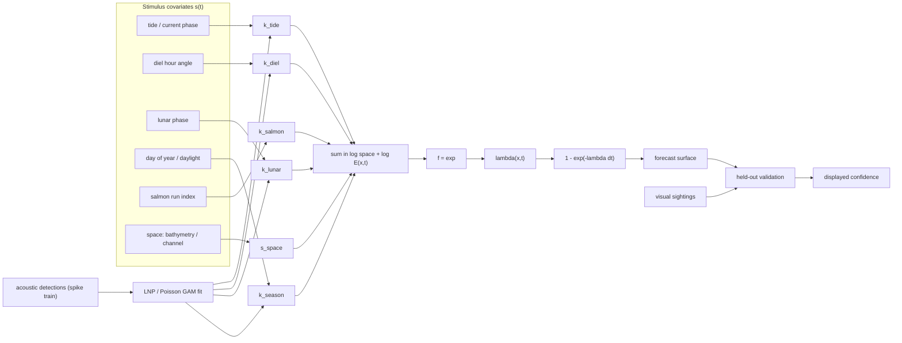
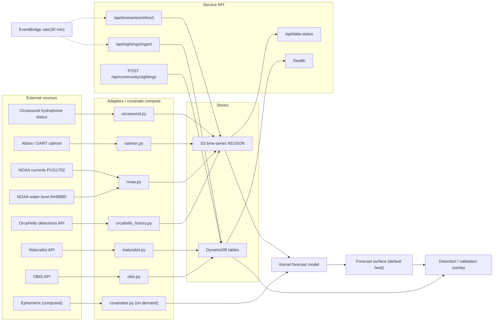
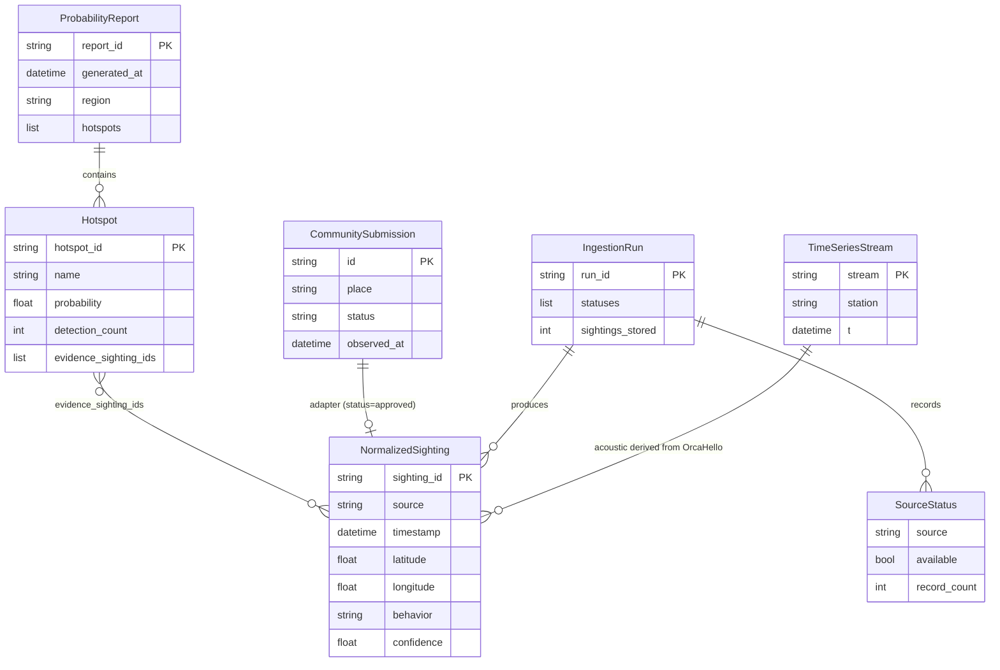

# orcast methodology

The methodology of record for orcast: a pilot study on forecast durability for orca encounter probability in the San Juan Islands / Salish Sea. This document explains what orcast forecasts, how it forecasts it, what data feeds the forecast, how that data is stored and served, how the model is estimated and calibrated, and the honesty guardrails that govern what the product is allowed to claim.

Companion design notes: [FORECAST_KERNELS.md](FORECAST_KERNELS.md) (the kernel model), [CALIBRATION_STUDIES.md](CALIBRATION_STUDIES.md) (estimation and fitness gates), [DATA_WIRING.md](DATA_WIRING.md) (the data layer), and [../ml/ORCA_ML_INTEGRATION.md](../ml/ORCA_ML_INTEGRATION.md) (external ML/data catalog).

Status note: the data layer described in "The data layer" is wired, ingesting, and validated (live counts verified 2026-06-19). The kernel model in "The kernel forecast model" and the studies in "Estimation and calibration studies" are a designed, gated program; no kernel is fitted yet. The two are kept distinct on purpose: what is live is stated as live, what is planned is stated as planned.

---

## 1. Overview and honest framing

orcast renders a map of where orcas are likely to be encountered, over space and time, for the inland waters around the San Juan Islands (region bounds: latitude 48.40–48.70, longitude −123.25 to −122.75).

The design commitment is that the map heat is a **modeled probability surface**, not a restyled plot of recent detections. The forecast is the default surface and is always shown. Honesty is not handled by hiding the forecast or stamping it "experimental"; it is handled by what the forecast displays:

1. The forecast always carries its own uncertainty. Early on (few kernels fitted) it is broad and clearly low-confidence; as kernels are estimated it sharpens. The confidence is part of the forecast, not a disqualifying badge.
2. We never render sharper structure than the current evidence supports. The fitness gates (Section 7) govern how confident and how sharp the forecast is allowed to be, not whether it is shown.
3. The detection/validation overlay is always one tap away, so anyone can check the forecast against what was actually observed. Validation is a first-class, user-controllable layer, not a footnote.

This reframes the role of reported sightings: they are **not** the heat. They are the model's referee (held-out validation), the social/field-log layer, and the citizen-science contribution that feeds estimation.

---

## 2. The kernel forecast model

### 2.1 Model form

Model the expected orca encounter intensity at location `x` and time `t` as a log-linear (Poisson point-process) product of a spatial habitat term and separable temporal/environmental kernels. In log space the product becomes a sum, so each kernel is additive and separately interpretable:

\[
\log \lambda(x,t) = b_0 + s_{\text{space}}(x) + k_{\text{tide}}(\phi_{\text{tide}}(x,t)) + k_{\text{diel}}(h(t)) + k_{\text{lunar}}(m(t)) + k_{\text{season}}(d(t)) + k_{\text{salmon}}(r(t)) + \log E(x,t)
\]

where

- \(b_0\) is the baseline log-rate,
- \(s_{\text{space}}(x)\) is the habitat/bathymetry/channel prior,
- \(k_{\text{tide}}\) is a cyclic kernel over tidal phase / current state \(\phi_{\text{tide}}\),
- \(k_{\text{diel}}\) is a cyclic kernel over solar hour angle \(h\),
- \(k_{\text{lunar}}\) is a cyclic kernel over moon phase \(m\) (~29.5 d),
- \(k_{\text{season}}\) is a cyclic kernel over day-of-year \(d\),
- \(k_{\text{salmon}}\) is an aperiodic smooth over the salmon run-timing index \(r\),
- \(\log E(x,t)\) is the observation-effort / detection offset.

Each \(k_*\) is a smooth function of its covariate (periodic spline / Fourier basis for the cyclic kernels; aperiodic smooths for \(k_{\text{salmon}}\) and \(s_{\text{space}}\)). For display, the rate is converted to a 0–1 encounter probability per cell and time bin:

\[
p(x,t) = 1 - e^{-\lambda(x,t)\,\Delta t}.
\]

### 2.2 Why log-linear separable kernels

- **Interpretable.** Each kernel is a curve you can publish and critique ("encounters peak about 2 h after flood onset at Lime Kiln").
- **Estimable from sparse data.** Far fewer parameters than a free 4-D surface.
- **Honest about structure.** It assumes separability, and the validation step (Section 5) tests that assumption rather than asserting it.

This is, formally, the linear–nonlinear–Poisson (LNP) cascade used to characterize sensory neurons: environment \(s(t)\) → linear kernels \(k\) → nonlinearity \(f=\exp\) → rate \(\lambda(t)\) → events (detections). A hydrophone is a "detector unit," its detection times are the "spike train," and the environmental cycles are the "stimulus." That correspondence is why the neuroscience estimation toolkit (Section 6) applies directly.

The kernel-to-rate pipeline, and where detections enter for fitting versus validation:



Rendered figure: [figures/model_pipeline.pdf](figures/model_pipeline.pdf) ([PNG](figures/model_pipeline.png)).

### 2.3 The kernels and their data

| Kernel | Timescale | Covariate | Data source | Available now? |
|--------|-----------|-----------|-------------|----------------|
| `k_tide` | ~6.2 h / ~12.4 h | tidal height + current phase | NOAA CO-OPS (Friday Harbor 9449880; Rosario Strait currents PUG1702) | Yes (series stored) |
| `k_diel` | 24 h | local solar hour angle | computed from timestamp + lon | Yes (on demand) |
| `k_lunar` | 29.5 d | moon phase / illumination | ephemeris (computed) | Yes (on demand) |
| `k_season` | annual | day of year, daylight hours | computed from date + lat | Yes (on demand) |
| `k_salmon` | weeks–seasonal | run-timing index (Chinook) | Albion test fishery + DART, climatology fallback | Yes (series stored) |
| `s_space` | static | location (channel, bathymetry, shoreline) | bathymetry + effort-corrected sighting density | Partial (bathymetry + land mask shipped) |

---

## 3. Instruments and the de-biasing logic

### 3.1 The central methodological risk: effort and detection bias

Visual sightings are presence-only with severe, structured observation bias: more observers near Lime Kiln, ferry routes, in daylight, and in summer. Naively fitting `k_diel` to sightings would learn "daytime" because people watch in daytime; `k_season` would learn tourism, not orcas. This must be designed out, or the kernels are nonsense.

Two levers:

1. **Acoustic data carries the temporal truth.** OrcaHello / Orcasound hydrophones monitor continuously, with effort that does not track human daylight or tourism. The temporal kernels (`k_diel`, `k_tide`, `k_lunar`, `k_season`) are estimated primarily from continuous acoustic detections at fixed stations, where effort `E` is known and roughly constant.
2. **Explicit effort offset \(\log E(x,t)\).** Where effort is heterogeneous (visual), an effort/detection model (observer density, daylight, station uptime) enters as an offset so the kernels estimate presence, not observation.

This splits the instrument roles cleanly:

| Instrument | Role | Why |
|------------|------|-----|
| Hydrophones (acoustic, 24/7) | Estimate the temporal kernels; feed the field | Constant effort → event times reflect the animal cycle, not human cycles |
| NOAA tides/currents, ephemeris, salmon index | Stimulus covariates | The environmental cycles the kernels are tuned to |
| Visual sightings (OBIS / community) | Held-out validation + social layer + citizen science | Effort-confounded; reserved for referee and corroboration, not temporal fitting |

A caveat carried throughout: acoustic presence is not the same as a visible encounter for a shore or kayak viewer. The bridge from acoustic \(\lambda\) to visible-encounter probability is an open decision (a learned link, or presenting the two as honest, separate layers).

---

## 4. The data layer (what is wired)

Gate principle: nothing in the forecast program starts until every source below is ingested, stored, scheduled, and validated. That gate is the subject of [DATA_WIRING.md](DATA_WIRING.md). As of **2026-06-19** the gate is satisfied; the live counts below are verified.

### 4.1 Live data inventory

Time-series history is stored as **S3 partitioned NDJSON** under `timeseries/{stream}/{station}/{yyyy}/{mm}.ndjson`. DynamoDB tables serve entity / "latest" reads. Sightings live in DynamoDB; `/health` reports `healthy` with 76 normalized sightings.

| Stream / store | Source | Records (verified 2026-06-19) | Coverage |
|----------------|--------|-------------------------------|----------|
| `acoustic_detections` (S3) | OrcaHello (in-region, station `haro_strait`) | 761 | 2020-09 .. 2021-04 |
| `env_water_level` (S3) | NOAA CO-OPS Friday Harbor 9449880 | 175,445 | hourly history |
| `env_currents` (S3) | NOAA CO-OPS Rosario Strait PUG1702 (predictions) | 17,544 | predictions |
| `salmon_run_index` (S3) | Albion / DART + climatology fallback (`salish_sea`) | 783 days | daily |
| `station_uptime` (S3) | hydrophone status across 9 Orcasound stations | 27 samples | accumulating |
| sightings — `obis_verified` (DynamoDB) | live OBIS API | 248 | live |
| sightings — `inaturalist` (DynamoDB) | iNaturalist API | 5 | live |
| sightings — `orcahello` (DynamoDB) | OrcaHello | 1 | live |
| sightings — `community` (DynamoDB) | community self-posting | 1 | live |

Static assets (committed): `data/geo/san_juan_land.geojson` (50 island polygons, OSM coastline) and `data/geo/san_juan_bathymetry.json` (589 points, NOAA ETOPO1, depth −320 .. +621 m). Diel/solar/lunar covariates are computed on demand (no store).

### 4.2 Storage contract

All adapters write through a single `TimeSeriesStore` abstraction (S3 NDJSON in production, an in-memory mirror for tests), and the offline fitting reads through it:

```python
put_series(stream: str, station: str, records: list[dict]) -> int   # records carry an ISO 't'
get_series(stream: str, station: str, start: datetime, end: datetime) -> list[dict]
list_stations(stream: str) -> list[str]
```

Partitions are merged per month, deduplicated by `(t, id)` with the incoming record winning, and returned sorted by `t`.

### 4.3 Scheduling

An EventBridge `rate(30 min)` rule invokes a Lambda that makes keyed calls to `/api/sightings/ingest` and `/api/timeseries/refresh`. The refresh path pulls recent acoustic, NOAA water level / currents, the current-year salmon index, and a station-uptime sample, writing each through the store. A one-time backfill entrypoint loads the full available history.

---

## 5. Architecture and data flow

Sources feed adapters, adapters write to the two stores, the API serves status and ingest endpoints, and the kernel model reads the stores to produce the forecast surface. The public community endpoint and the EventBridge schedule both write into this same pipeline ("self-posting": the public `POST /api/community/sightings` writes a citizen-science submission, and the scheduled service self-writes the time-series streams).



Rendered figure: [figures/data_flow.pdf](figures/data_flow.pdf) ([PNG](figures/data_flow.png)).

---

## 6. Database design and ERD

Two stores back the system: **DynamoDB** for entities (each table keyed by `pk = id`) and the **S3 time-series** NDJSON store for the environmental and acoustic streams.

### 6.1 DynamoDB tables

| Table | Entity | Key fields |
|-------|--------|-----------|
| `orcast-aws-backend-sightings` | `NormalizedSighting` | `sighting_id`, `source`, `timestamp`, `latitude`, `longitude`, `behavior`, `confidence`, `source_reliability`, `cross_validation`, `evidence[]`, `environmental` |
| `orcast-aws-backend-hotspots` | `Hotspot` | `hotspot_id`, `name`, `center_latitude`, `center_longitude`, `radius_km`, `probability`, `confidence`, `detection_count`, `evidence_sighting_ids[]` |
| `orcast-aws-backend-reports` | `ProbabilityReport` | `report_id`, `generated_at`, `region`, `summary`, `hotspots[]`, `model_version` |
| `orcast-aws-backend-ingestion-runs` | `IngestionRun` | `run_id`, `started_at`, `completed_at`, `statuses[]`, `sightings_ingested`, `sightings_stored`, `errors[]` |
| `orcast-aws-backend-community-submissions` | `CommunitySubmission` | `id`, `place`, `latitude?`, `longitude?`, `observed_at`, `behavior`, `count?`, `notes?`, `observer_name?`, `status`, `submitted_at`, `reviewed_at?` |

### 6.2 Relationships

- A `ProbabilityReport` **contains** `Hotspot`s.
- A `Hotspot`'s `evidence_sighting_ids` **reference** `NormalizedSighting`s.
- A `CommunitySubmission` with `status = approved` is **adapted into** a `NormalizedSighting` (`source = community`).
- An `IngestionRun` **records** a `SourceStatus` per source and **produces** `NormalizedSighting`s.
- The `acoustic_detections` time-series is **derived from** OrcaHello; sightings and hotspots are **derived from** ingestion.



Rendered figure: [figures/erd.pdf](figures/erd.pdf) ([PNG](figures/erd.png)).

---

## 7. Estimation and calibration studies

The kernels are estimated with methods borrowed from sensory neuroscience, because recovering a kernel `k` and a nonlinearity `f` from a spike train and a stimulus is exactly the LNP problem. Each level below states the data it needs and a go/no-go fitness gate; we do not let the forecast sharpen past a level until that level passes on held-out data, with splits blocked by time (whole cycles held out) to prevent leakage.

### 7.1 Estimation methods

1. **Peristimulus time histogram (PSTH) for cyclic kernels.** For each cyclic covariate, define a repeating stimulus event (sunrise for diel, flood-current onset for tidal, new moon for lunar, Jan 1 / run onset for seasonal, run peak for salmon), align detections to it, bin by phase, divide by occupancy/effort, and smooth with a periodic spline; bootstrap cycles for confidence bands. This is the cheapest, most legible first estimate and yields the publishable tuning curve.
2. **Reverse correlation / detection-triggered average.** For continuous covariates (current speed, tide height, temperature), average the covariate trajectory in a window around each detection — the spike-triggered average. Whitening the covariate autocorrelation (regularized STA / spike-triggered covariance) separates correlated covariates such as tide and current.
3. **Joint LNP / Poisson GLM–GAM (the actual estimator).** \(\log \lambda(\text{station}, t) = b_0 + a_{\text{station}} + \sum_j \text{spline}_j(\text{cov}_j(t)) + \log E(\text{station}, t)\), with penalized cyclic splines, station random effects, and an effort offset, fit by penalized likelihood or with GP/spline priors for uncertainty. The fitted splines are the kernels; they should match the PSTH/STA shapes (a consistency check).

### 7.2 Leveled plan with fitness gates

| Level | Goal | Data needed | Fitness gate |
|-------|------|-------------|--------------|
| **L0** Instrument characterization | Know the detector and effort before modeling presence | OrcaHello detections + confirmed labels; station logs | Per-station effort series known; detector ROC AUC / d′ reported with CI |
| **L1** Single-covariate PSTH (start diel) | Recover one kernel, de-biased by effort | ≥ ~6–12 months continuous acoustic at ≥ 1 station | PSTH beats a phase-shuffled null (permutation test); shape consistent across stations |
| **L2** Joint temporal LNP | Separate correlated cycles (tide + diel + lunar + season) | ≥ 1 lunar year of acoustic | Held-out Poisson log-likelihood beats climatology and best single-covariate model; kernels stable across folds; joint and PSTH shapes agree |
| **L3** Prey + space → field | Full spatiotemporal intensity | salmon run-timing series; bathymetry; sightings for space | Held-out skill beats recent-detection-density baseline; calibration within tolerance (reliability near diagonal; PIT ~uniform) |
| **L4** Population decoding + uncertainty | Region forecast with honest confidence | multi-station concurrent detections; visual sightings as independent validation | Localization validated against held-out visual sightings; forecast beats persistence; calibration holds out of sample |
| **L5** Full-confidence forecast | The earned, high-confidence surface | L3–L4 passed | Calibration holds out of sample; displayed confidence is high |

The forecast is the default surface from Phase 0 onward; each gate raises how sharp and confident it is allowed to be, not whether it is shown. At earlier levels the same forecast is shown with broader uncertainty and the validation overlay one tap away.

### 7.3 Sensory-transduction calibration assays

Beyond fitting, these assays probe whether the response behaves like a real transduction system, which is how the curves earn trust:

1. **Dose-response.** Bin a covariate (e.g. current speed) into doses; plot detection rate per dose and look for threshold/saturation (Hill-type). Tests monotonicity and whether a simple spline is justified.
2. **Adaptation / habituation.** Within a multi-day presence bout, does detection rate decay? If so, the static kernel needs a slow gain/adaptation term.
3. **Signal detection (d′, ROC).** Characterize the detector (L0) across noise conditions (vessel noise, sea state), so animal presence is not confounded with detectability.
4. **Null and shuffle controls.** Phase-shuffled and circularly-shifted nulls for every PSTH; the kernel must beat them.
5. **Cross-validation skill.** Held-out deviance, explained-variance ratio vs PSTH-shuffled null, and forecast skill (Brier, log-loss) vs baselines.
6. **Reliability and PIT.** Reliability diagram and probability-integral-transform histograms for the probabilistic output.
7. **Population / emergence read-out.** Treat the network as a distributed sensor array; test whether region-scale predictability rises with station count. Framed honestly as sensor fusion / population coding (per-station LNP units feeding a population layer), not a claim of cognition.

### 7.4 Population decoding

At L4 the station array is treated as a population code: per-station LNP units feed a population layer (population-vector / Bayesian decoder) that produces a calibrated region-level probability field with uncertainty, validated against held-out visual sightings.

---

## 8. Roadmap

- **Phase 0 (now).** Data layer wired and validated (Section 4); covariate library (tide/diel/lunar/season computed; salmon series stored); instrument-panel overlay UX. The forecast is the default surface, prior-driven, broad, shown with explicit low confidence.
- **Phase 1.** Assemble ≥ 1 year of acoustic detections + covariates; fit `k_diel`, `k_tide`, `k_lunar`, `k_season` from acoustic (L1–L2); publish kernel curves with CIs; stand up the validation harness. The forecast sharpens and its confidence rises.
- **Phase 2.** Add `k_salmon` and `s_space`; full \(\lambda(x,t)\) (L3); backtest vs baselines; confidence reflects held-out skill.
- **Phase 3.** Richer uncertainty-aware display and population decoding (L4); per-ecotype models if labels support it.

Architecture target: a `kernel_model` module beside the existing scoring code computes covariates, holds fitted kernel coefficients, and serves \(\lambda(x,t)\) grids; fitting runs offline (notebook / batch), and the service loads coefficients. The validation harness produces the forecast's displayed confidence.

---

## 9. Honesty guardrails

What orcast must not claim:

- **Not live ML.** orcast consumes the OrcaHello detections API; it does not run the detector model.
- **Detections are candidates at a hydrophone.** OrcaHello records are unreviewed acoustic candidates at a named hydrophone; the unreviewed stream is dominated by false positives. Prefer moderator-confirmed records for any "detected" language.
- **A detection's coordinates are the hydrophone's location, not the animal's.** Never plot a detection as a precise orca fix.
- **No pod or ecotype identity** unless a source field actually provides it.
- **External research is provenance, not capability.** Perch 2.0, Palmer 2025, Pod.Cast, and Watkins are cited as data/research, not presented as orcast features.
- **Respect licenses.** OrcaHello-RAIL for the model (Be Whale Wise, no captive-industry use, no MMPA violation); CC BY-NC-SA 4.0 for Orcasound open data. orcast is non-commercial.
- **The forecast is shown honestly, not hidden.** Pre-fit it is broad and low-confidence; the fitness gates raise its confidence, they do not flip a visibility switch. The validation overlay is always available so the forecast can be checked against observed detections.

---

## Figures

| Figure | Source | Rendered |
|--------|--------|----------|
| Data-wiring flow | [figures/data_flow.mmd](figures/data_flow.mmd) | [PDF](figures/data_flow.pdf) · [PNG](figures/data_flow.png) |
| Database ERD | [figures/erd.mmd](figures/erd.mmd) | [PDF](figures/erd.pdf) · [PNG](figures/erd.png) |
| Model pipeline | [figures/model_pipeline.mmd](figures/model_pipeline.mmd) | [PDF](figures/model_pipeline.pdf) · [PNG](figures/model_pipeline.png) |
