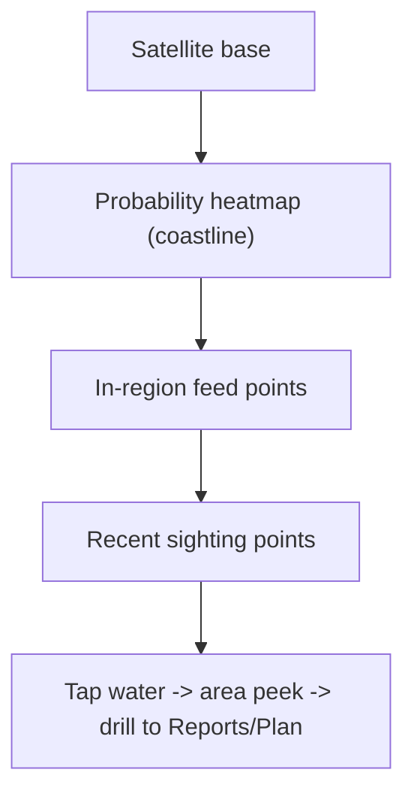

# Dynamic map UX

How one configurable map serves every page, leads the landing with a coastline heatmap, and makes discovery visual instead of name-typed. This spec is design intent for a later build phase; it references existing code so implementation can adopt it.

Related: [USER_JOURNEYS.md](USER_JOURNEYS.md), [MAP_DATA_TRUTH.md](MAP_DATA_TRUTH.md).

## Problem with today's maps

- Each page hand-rolls its own `<google-map>` options and panels; behavior drifts (black-void regressions, inconsistent panels).
- The landing has no map, so the first impression is text and the only way to "find" anything is to navigate to a page and read names.
- Markers and feeds are placed straight from raw data, so points land on terrain and out-of-region feeds scatter.

## Landing heatmap hero

The front door becomes a map.

- **Layers on load:** satellite base, probability heatmap along the coastline, in-region feed points (cameras/hydrophones), recent sighting points.
- **Data source:** probability surface from the same scoring as `/reports` and `/ml-predictions` (the `forecast/spatial` grid, region-bounded and water-masked). Sighting points from verified sightings; feed points from the in-region hydrophone subset.
- **Framing:** archipelago bounds (see MAP_DATA_TRUTH), so the whole pilot area is visible without panning.
- **Primary interaction:** tap water to open a peek card for that area (chance summary + "See this week's report" / "Plan a trip here"). Hovering a feed point shows its name and last-detection age.
- **Copy over the map:** tagline + quiet pilot-data note; the two existing CTAs become secondary to the map tap.



## Map config model

One preset object per page drives a shared map wrapper, instead of per-component options. Conceptual shape:

```
MapPreset {
  center: {lat,lng}        // defaults to archipelago center
  zoom: number
  bounds: LatLngBounds     // archipelago bounds; fitBounds on load
  layers: LayerId[]        // which layers are on
  interaction: 'explore' | 'pick-point' | 'select-feature'
  initialSelection?: {lat,lng} | islandId | spotId   // carried-in context
}
```

- Built on the existing [`map.service.ts`](../../orcast-angular/src/app/services/map.service.ts) (`registerMap`, layer add/clear methods, `fitBounds`, `centerMap`). Add a `applyPreset(preset)` that sets framing + toggles layers.
- Pages declare a preset instead of duplicating `mapOptions` + panel markup. The shared `MapShell` ([`map-shell.component.ts`](../../orcast-angular/src/app/components/shared/map-shell.component.ts)) already projects panels; presets standardize the map half.

| Page | center/bounds | layers | interaction | initialSelection |
|------|---------------|--------|-------------|------------------|
| Landing | archipelago bounds | heatmap, feeds, sightings | explore | none |
| Reports | bounds or carried area | hotspots, sightings | select-feature | carried area/spot |
| Historical | bounds | sightings (time-filtered) | select-feature | time window |
| Recent | bounds | sightings, feeds, connectors | select-feature | none |
| Score grid | bounds | heatmap | explore | none |
| Plan | island on pick | hotspots near island | select-feature | carried island |
| Contribute | bounds | pin, feeds | pick-point | carried spot |

## Layer system

Each layer is independent and individually clearable (the marker layering already exists in `map.service.ts`).

- **heatmap:** weighted probability surface; legend maps color to chance. Low values rendered with a floor so a sparse surface still reads.
- **sightings:** in-water sighting points; themed info card (not the default white popup); behavior-colored.
- **feeds:** camera/hydrophone points, in-region only; distinct icon; hover shows name + last-detection age.
- **connectors:** thin line from a selected in-water sighting to its nearest in-region feed (see MAP_DATA_TRUTH linkage rule).
- **hotspots:** ranked report spots (reuses `addReportHotspots` + `fitBounds`).
- **pin:** single user-placed marker for Contribute, snapped to water.

## Visual-first discovery

- Default action everywhere is "look, then tap." Warm zones and pins are the affordances.
- **Tap water** selects an area/feature; never require typing to find a place.
- **Peek cards** summarize on tap/hover before committing to navigation.
- Free text appears only where a human must phrase something (Contribute notes, Partners contact). Contribute location is pin-first; a place name is derived from the pin, not typed.
- Replace any "search by exact name" pattern with map selection + optional fuzzy filter as a fine-tuning layer, never the primary path.

## Interaction states (every map page)

- **Loading:** satellite base visible immediately; layers shimmer in. Never a black void (the projected map slot must hold viewport height; see the styles.scss fix already in place).
- **Empty / sparse:** explicit copy ("Pilot dataset — few points so far"), not a blank screen.
- **Low probability:** heatmap still renders with a floor; legend explains low values are expected in the pilot.
- **Selected feature:** focus ring + themed card; list and map stay in sync.
- **Mobile:** panels become bottom sheets; map keeps the top two-thirds; one panel open at a time.
- **No console errors:** map init via `registerMap` only; no duplicate map creation; resize triggered after layout.

## Adoption path (for the later build)

1. Add `MapPreset` + `applyPreset` to `map.service.ts`; keep existing methods.
2. Build the landing map hero from a preset (new biggest change).
3. Convert each map page to declare a preset (removes duplicated options).
4. Add heatmap floor + themed info card + connector layer.
5. Wire carried-in selection between pages.
