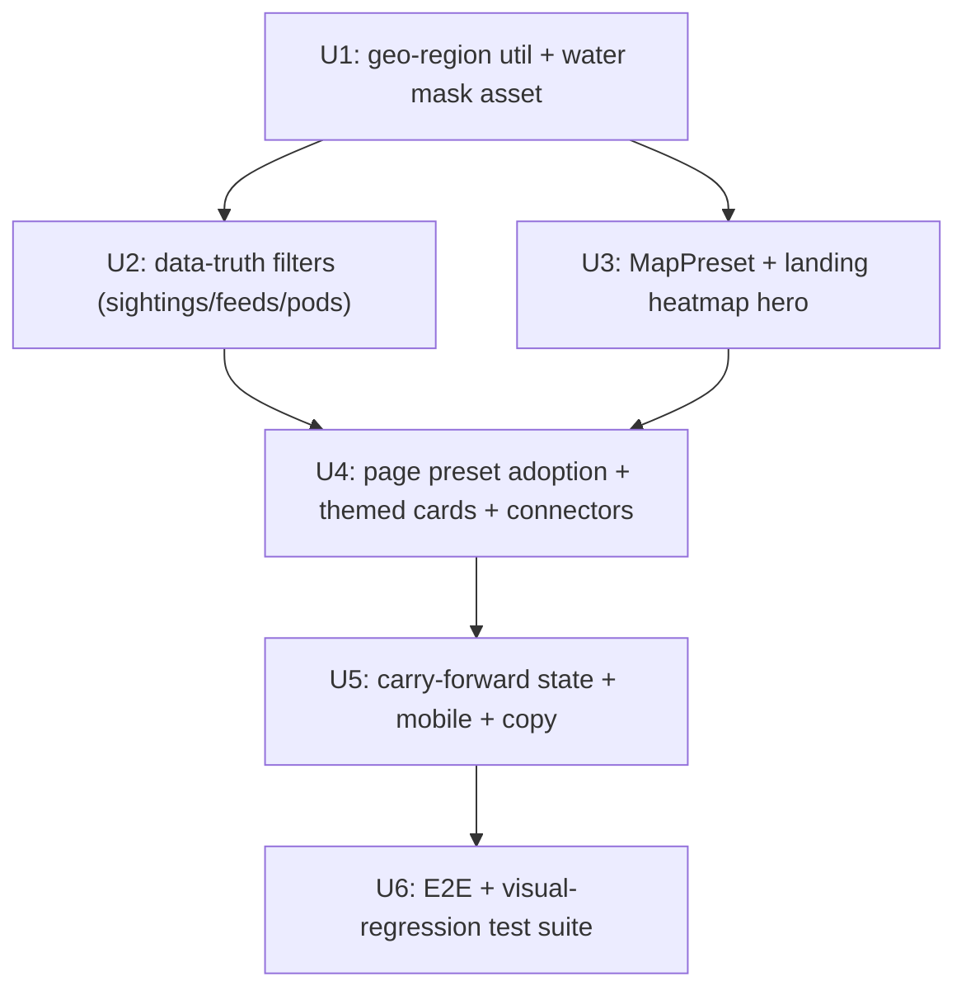

# Implementation backlog (Phase 6 design to build)

**Waves registry:** [WAVES_REGISTRY.md](../devpost/WAVES_REGISTRY.md) (canonical IDs U1–U6).

Prioritized build items derived from [USER_JOURNEYS.md](USER_JOURNEYS.md), [DYNAMIC_MAP_UX.md](DYNAMIC_MAP_UX.md), and [MAP_DATA_TRUTH.md](MAP_DATA_TRUTH.md). Each item names the journey it serves and the target files. This is the scoping input for the next (separately confirmed) build phase; nothing here is built yet.

## Priority tiers

- **P0** — fixes the embarrassing/false things and the first impression.
- **P1** — makes the map experience coherent and seamless.
- **P2** — polish and cross-page continuity.

## P0 — truth + first impression

| Item | Journey | Target files |
|------|---------|--------------|
| Region bounding box + water mask utility (point-in-polygon, snap-to-water) | all map pages | new `orcast-angular/src/app/services/geo-region.ts` (+ static archipelago GeoJSON asset) |
| Filter sightings + clamp hotspot centers to water | Historical, Reports, Recent, Landing | [`map.service.ts`](../../orcast-angular/src/app/services/map.service.ts), [`backend.service.ts`](../../orcast-angular/src/app/services/backend.service.ts) |
| Hide out-of-region feeds | Recent, Landing | [`backend.service.ts`](../../orcast-angular/src/app/services/backend.service.ts) (`convertHydrophones`), [`map.service.ts`](../../orcast-angular/src/app/services/map.service.ts) |
| Remove fabricated pod identity (drop J/K/L filters, "Top pod"; show pod size + behavior) | Historical | [`historical-sightings.component.ts`](../../orcast-angular/src/app/components/historical-sightings/historical-sightings.component.ts), [`backend.service.ts`](../../orcast-angular/src/app/services/backend.service.ts) (`inferPod`), models |
| Landing heatmap hero (probability surface + feeds + sightings, tap-to-drill) | Landing | [`landing.component.ts`](../../orcast-angular/src/app/components/landing/landing.component.ts), [`map.service.ts`](../../orcast-angular/src/app/services/map.service.ts) |

## P1 — coherent, seamless maps

| Item | Journey | Target files |
|------|---------|--------------|
| `MapPreset` + `applyPreset` on the map service | all map pages | [`map.service.ts`](../../orcast-angular/src/app/services/map.service.ts) |
| Convert each map page to declare a preset (remove duplicated `mapOptions`) | Reports, Historical, Recent, Score grid, Plan | the five map components |
| Themed info card (replace default white Google popup) | Historical, Recent, Reports | [`map.service.ts`](../../orcast-angular/src/app/services/map.service.ts) info-content builders |
| Heatmap floor so sparse surface still reads + legend | Landing, Score grid | [`map.service.ts`](../../orcast-angular/src/app/services/map.service.ts) (`addMLPredictionHeatMap`) |
| Sighting-to-nearest-feed connector layer | Recent, Landing | [`map.service.ts`](../../orcast-angular/src/app/services/map.service.ts) |
| Visual-first discovery: tap-water peek cards | Landing, Reports | landing + reports components |

## P2 — continuity + polish

| Item | Journey | Target files |
|------|---------|--------------|
| Carry-forward state between pages (tapped area, island, spot) | spine | a small shared state/service + route/query params |
| Contribute pin snap-to-water at source | Contribute | [`contribute.component.ts`](../../orcast-angular/src/app/components/contribute/contribute.component.ts) |
| Mobile bottom-sheet panel behavior consistency | all map pages | `styles.scss`, `MapShell` |
| Sparse/empty/low-probability state copy pass | all | components + [`../UI_COPY.md`](../UI_COPY.md) |

## Suggested build waves (next phase)

U1 is the dependency for the P0 truth fixes and should land first. The E2E/visual-regression suite (U6) becomes the gate once the new map UX exists, so these exact regressions cannot ship again.

## Open questions for the build phase

- Source of the water/land polygon: ship a trimmed GeoJSON of the San Juans (preferred) vs an external tile service.
- Whether data-truth filters live frontend-only first, or go straight into the backend pipeline (`scoring.py`, normalizers).
- Exact archipelago bounds and whether to include nearby waters (e.g. Haro Strait west edge) in the pilot frame.
