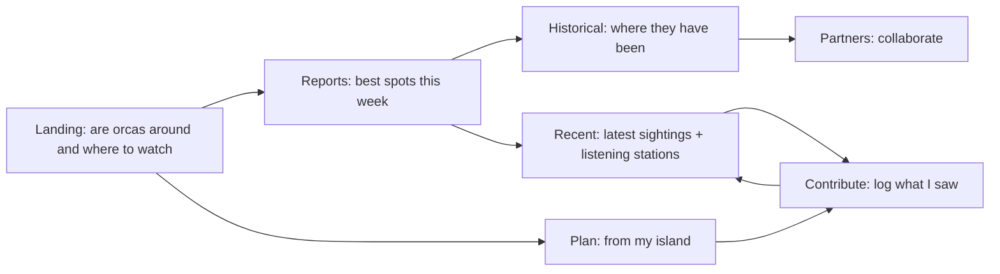
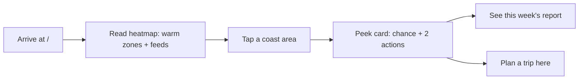
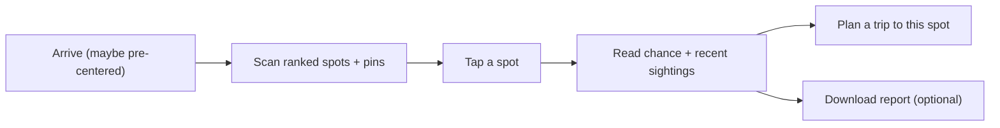
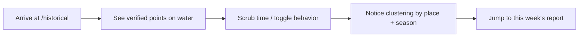
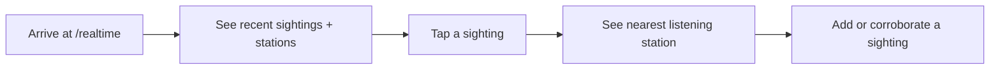
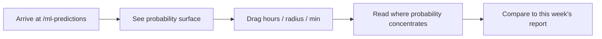
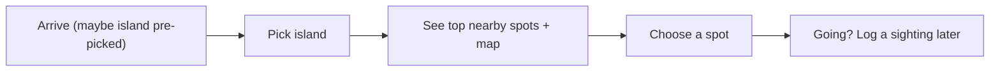
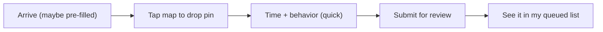
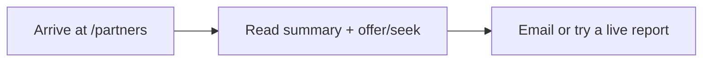

# orcast user journeys

Design-first storyboards for every page. The goal: each page answers "what is this for, here," delivers a first impression that needs no instructions, and offers one effortless input that drives the story to the next page. Discovery is visual (read the map, tap the water), not type-the-exact-name.

Read alongside:
- [DYNAMIC_MAP_UX.md](DYNAMIC_MAP_UX.md) — the shared map config, layers, and interaction patterns these journeys assume.
- [MAP_DATA_TRUTH.md](MAP_DATA_TRUTH.md) — region bounding, in-water placement, feed filtering, pod honesty.
- [IMPLEMENTATION_BACKLOG.md](IMPLEMENTATION_BACKLOG.md) — prioritized build items mapped to these journeys.
- [../UI_COPY.md](../UI_COPY.md) — voice and approved phrases.

## Design principles

1. Show, then let them act. The map is the interface; controls are secondary.
2. One primary action per page. Everything else is peripheral.
3. No required typing for discovery. Tap, scrub, pick. Free text is only for things only a human can phrase (notes).
4. Carry context forward. A selection on one page pre-seeds the next.
5. Honest by construction. Never display precision the data lacks (no fabricated pod identity, no land-locked orcas, no out-of-region feeds).
6. Sparse data is framed, not hidden. Pilot density is acknowledged in copy and empty states.

## Journey template (applied to every page)

- **Job:** the one-line purpose.
- **First impression:** what renders instantly; what carried over from the previous page.
- **Primary input:** the single action that advances the story.
- **Effortless by design:** how layout/affordance make that input obvious and low-effort.
- **Carry-forward:** state handed to the next page.
- **Journey map:** entry to action to outcome to next.
- **Sensory/seamless:** motion, focus, what changes on input.

## Cross-page narrative spine

Each page is a beat in one story: "are orcas around, where, when, and how do I go see them or add what I saw."

First-impression payload that should persist across the whole spine: the archipelago map framing (same bounds, same coastline), the current probability surface, and the user's last selected area or island.

---

## 1. Landing `/`

- **Job:** In five seconds, answer "are orcas likely around the San Juans right now, and where would I watch?"
- **First impression:** A live coastline heatmap of sighting probability across the archipelago, with camera/hydrophone feed points marked in-water. The tagline sits over or beside the map, not above an empty hero. Pilot-data note is visible but quiet. (Entry point; nothing carried in.)
- **Primary input:** Tap a warm area of the coast (or a feed point). No typing.
- **Effortless by design:** The map is the hero and fills the viewport; warm zones pull the eye; tapping anywhere on water opens a peek ("Lime Kiln area — elevated chance this week") with two buttons: "See this week's report" and "Plan a trip here." The two text CTAs become secondary.
- **Carry-forward:** Tapped location/area to Reports or Plan (pre-centers their map and pre-selects the nearest island/region).
- **Journey map:**

- **Sensory/seamless:** Heatmap fades in over the satellite base; feed points pulse softly when a recent detection exists; tapping drops a focus ring and the peek card slides up from the bottom on mobile.

---

## 2. Reports `/reports`

- **Job:** "Where are the best spots to watch this week, by name, on the map?"
- **First impression:** The split view already populated: ranked spots on the left, the same archipelago map on the right with the spots pinned. If arriving from Landing, the map is centered on the tapped area and that spot is highlighted.
- **Primary input:** Tap a spot card or a map pin to focus it; optionally drag the confidence slider to tighten the list.
- **Effortless by design:** Cards and pins are the same objects; selecting one syncs the other. Plain language ("chance of sightings", "recent sightings near here"); internal IDs stay in the collapsed details. Slider is one control, labeled in human terms.
- **Carry-forward:** Selected spot to Plan (as the destination) and to Contribute (pre-fill nearest place + coords).
- **Journey map:**

- **Sensory/seamless:** Selecting a card pans/zooms the map to the pin and pulses it; the list scrolls the active card into view when a pin is tapped.

---

## 3. Historical `/historical`

- **Job:** "Where have orcas actually been seen, and when?"
- **First impression:** Archipelago map with verified sighting points (in-water only), a time scrubber, and behavior filters. Sparse-pilot count is stated plainly.
- **Primary input:** Drag the time scrubber; toggle behaviors. (No pod-identity filters — that data does not exist; see MAP_DATA_TRUTH.)
- **Effortless by design:** Scrubbing animates points appearing/disappearing so cause and effect is obvious. Filters are few and behavior-only. Stats update live beside the scrubber.
- **Carry-forward:** Current time window + visible area to Reports/Recent so the user keeps their frame.
- **Journey map:**

- **Sensory/seamless:** Time scrub crossfades markers; selecting a point opens a themed info card (not the default white Google popup) matching the dark UI.

---

## 4. Recent `/realtime`

- **Job:** "What has been seen lately, and where can I listen in?"
- **First impression:** Map with recent sighting points and the in-region listening stations (feeds) only. List of recent sightings with timestamps and a clear confidence label.
- **Primary input:** Tap a sighting or a station to focus it; each in-water sighting shows a connector to its nearest feed.
- **Effortless by design:** Stations panel collapsed by default; sightings lead. Tapping a list row centers the map and opens the themed card. "Recent" means recent — stale entries are labeled by age, not implied as live.
- **Carry-forward:** Selected sighting to Contribute (corroborate/add detail) and nearest feed context.
- **Journey map:**

- **Sensory/seamless:** A thin connector line animates from sighting to nearest feed on selection; station markers are visually distinct from sightings.

---

## 5. Score grid `/ml-predictions`

- **Job:** "Show the probability surface I can tune."
- **First impression:** The heatmap surface on the archipelago map with three sliders (hours, radius, min probability) pre-set so the grid is non-empty on arrival.
- **Primary input:** Drag a slider; the surface re-renders.
- **Effortless by design:** Defaults guarantee a visible surface (min probability below the realistic max). Results panel states grid points + max in plain terms. Low values are explained, not left looking broken. No model identifiers.
- **Carry-forward:** Current surface framing to Reports (same scoring) and Plan.
- **Journey map:**

- **Sensory/seamless:** Surface re-renders with a short debounce and a subtle loading shimmer; the legend maps color to chance.

---

## 6. Plan `/plan`

- **Job:** "From my island, where should I go?"
- **First impression:** Island picker (no typing) and, if arriving from Landing/Reports, the chosen area pre-selected with top spots already shown on the map.
- **Primary input:** Pick an island (or accept the carried-in one); optionally tap the map to refine.
- **Effortless by design:** Four large island choices; results are top spots near that island as cards + pins; honest caption ("based on recent sightings"). Cross-link to Contribute.
- **Carry-forward:** Chosen island + top spot to Contribute (pre-fill) and back to Reports.
- **Journey map:**

- **Sensory/seamless:** Selecting an island flies the map to that island and drops the top-3 pins with a brief stagger; fitBounds frames them.

---

## 7. Contribute `/contribute`

- **Job:** "Log what I saw, with as little friction as possible."
- **First impression:** "Add a sighting" with a map you tap to mark where you saw them. If arriving from Reports/Plan/Recent, the place and pin are pre-filled from the carried-in spot.
- **Primary input:** Tap the map to drop a pin (sets coords); the rest is short and mostly optional. Moderation note is clear.
- **Effortless by design:** Pin-first, not name-first — you point at the water instead of spelling a place. Only place + time are required; behavior is a pick; group size/name/notes optional. Success: "Submitted for review," with a local copy kept.
- **Carry-forward:** Submitted entry to Recent (after approval) and a personal queued list.
- **Journey map:**

- **Sensory/seamless:** Dropping a pin snaps to the nearest water (see MAP_DATA_TRUTH) and shows the chosen coords; on submit, the card animates into the queued list.

---

## 8. Partners `/partners`

- **Job:** "Understand the pilot and how to collaborate."
- **First impression:** Executive summary in the canonical voice, what we offer/seek framed around shore/kayak and research collaboration, and one clear contact action.
- **Primary input:** Email or "Try a live report" CTA.
- **Effortless by design:** Same nav/footer and card system as the rest of the site; no dev/internal text; one obvious contact path.
- **Carry-forward:** Into Reports (live proof) or an email thread.
- **Journey map:**

- **Sensory/seamless:** Calm, text-led page; the one CTA card is visually emphasized.

---

## What carries across, in one table

| From | To | Carried context |
|------|-----|-----------------|
| Landing | Reports / Plan | tapped area, nearest island, map center |
| Reports | Plan / Contribute | selected spot (name + coords) |
| Historical | Reports / Recent | time window, visible area |
| Recent | Contribute | selected sighting, nearest feed |
| Score grid | Reports / Plan | surface framing |
| Plan | Contribute / Reports | chosen island, top spot |
| Contribute | Recent | submitted entry (post-approval) |
