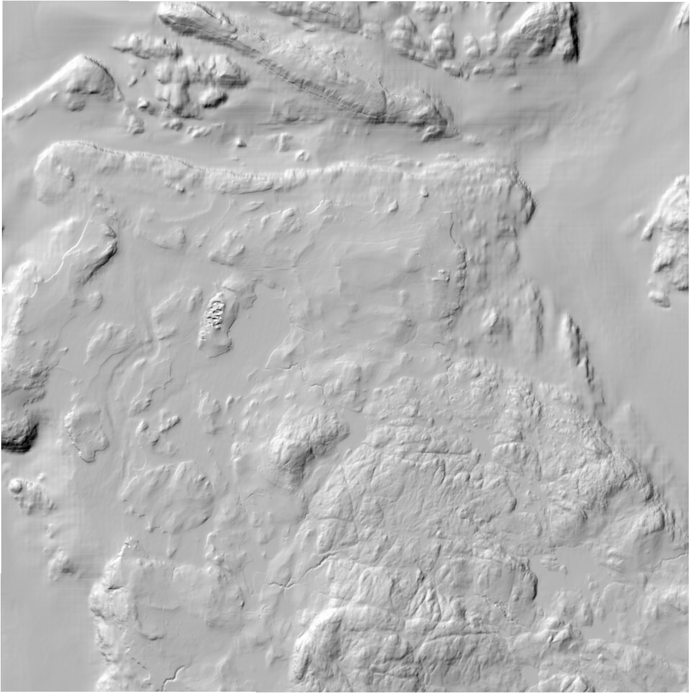
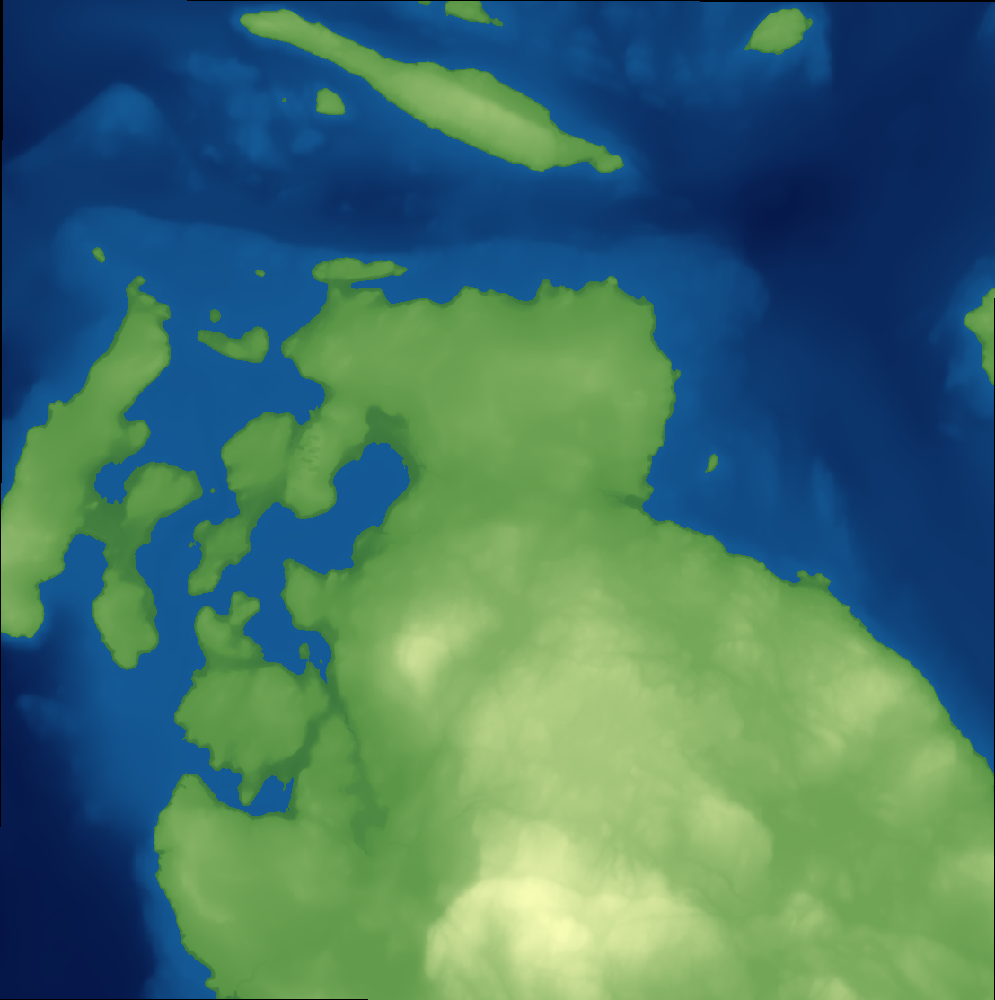

# Tiler bake-off, orcast terrain+bathymetry coastal twin (Wave 1, agent C)

Goal: pick the best pipeline to turn the integrated land+seafloor surface into a
form rendered by `3d-tiles-renderer` in the existing react-three-fiber scene.
Two candidates were produced and measured on one real pilot chunk:

1. **meshed-surface -> OGC 3D Tiles 1.1 (glTF)** -- a triangulated grid mesh
   exported as a binary glTF tile, wrapped in a minimal `tileset.json`.
2. **quantized-mesh terrain tiles** -- `cesium-terrain-builder` (CTB) producing
   `quantized-mesh-1.0` `.terrain` tiles + `layer.json`.

All conversions ran natively on the `aimez-services` EC2 (x86_64, Ubuntu 22.04)
as official `linux/amd64` docker images. No emulation.

## Pilot chunk (agent B's real output, NOT a stand-in)

Agent B's reprojected chunk was available in S3 when this ran, so the recorded
numbers use **agent B's actual `pilot_utm.tif`**, not a stand-in.

| Property | Value |
|----------|-------|
| Source | NOAA NCEI CUDEM 1/9 arc-sec topobathy, `wash_bellingham` (San Juan Islands) |
| CRS | EPSG:32610 (WGS84 / UTM 10N, metres) |
| Vertical | NAVD88 m (preserved through reprojection; B's `navd88_proof.txt` confirms) |
| Posting | 10 m |
| Grid | 1108 x 1113 (1,229,170 nodes) |
| Extent | ~11.07 x 11.12 km |
| Elevation range | -264.37 m to +273.88 m NAVD88 |
| Provenance | B: `s3://aimez-data/3dtwin/reproject/pilot_utm.tif`, `pilot_mesh.meta.json` |

Stand-in note: before B's output appeared, agent C also clipped a real CUDEM 1/9
chunk directly (Whidbey/Saratoga Passage, `wash_pugetsound`, ~3 m) as a fallback;
those `hs_source.png` / `hs_lod.png` / `color.png` figures are retained but the
decision and table below are entirely on B's San Juan chunk (`*_B.png`).

## Measured comparison

| Metric | Candidate 1: mesh -> 3D Tiles 1.1 (glTF) | Candidate 2: quantized-mesh (CTB) |
|--------|------------------------------------------|-----------------------------------|
| Geometry | 1,229,170 verts / 2,453,900 tris, 1 tile / 1 primitive | adaptive per-tile TIN, global geodetic pyramid z0-z15 |
| Output, full fidelity | **2.75 MB** (`pilot.dracoonly.glb`, Draco, no decimation) + 727 B tileset | **1.49 MB** (full pyramid, 746 `.terrain`) + 1.3 KB layer.json |
| Output, raw uncompressed | 56.2 MB (`pilot.glb`, float32) | n/a (format is intrinsically quantized) |
| Output, optimized LOD | **274 KB** (`pilot.draco.glb`, meshopt simplify->121,560 tris + Draco) | 917 KB (max-zoom z15 only, 532 tiles) |
| Tiles | 1 | 746 (z0-z15); 532 at native zoom z15 |
| **Draw calls (whole chunk, native)** | **1** (single tile, single primitive) | **~532** (one draw per native-zoom tile) |
| Draw calls, coarser LOD | 1 | ~140 at z14, ~42 at z13 |
| Vertical quant step | Draco 14-bit: 0.033 m (negligible) | QM 16-bit/tile: 0.016 m (negligible) |
| Fidelity, native | lossless (mesh == source grid) | ~source posting (adaptive TIN) |
| Fidelity, optimized LOD | RMSE 3.75 m / max 69.7 m vs source* | n/a (LOD is the pyramid itself) |
| Render frame | native local EPSG:32610 engineering frame, Y-up glTF (Y=NAVD88 m) | global geodetic (EPSG:4326 TMS) on the CesiumGS ellipsoid |
| Runtime | `3d-tiles-renderer` in plain three.js/r3f, **no Cesium** | needs a quantized-mesh decoder + ellipsoid placement (CesiumJS / QM plugin); `3d-tiles-renderer` does NOT natively read `.terrain` |

\* The LOD RMSE is a deliberately conservative proxy: the source was decimated to
the optimized vertex budget (~61-77k) and reconstructed with nearest-block
upsampling, which overstates terracing. The error-aware meshopt simplify used for
`pilot.draco.glb` produces a smoother surface at the same budget. Full-resolution
mesh (`pilot.dracoonly.glb`) is lossless.

### Visual fidelity (verified by inspecting the rendered hillshades)

- `figures/hs_source_B.png` -- source DEM hillshade: San Juan archipelago, crisp
  island ridgelines, channels, and submarine-channel detail.
- `figures/color_B.png` -- integrated land+seafloor color-relief: continuous
  surface across the 0 m shoreline (green land rising east, blue bathymetry in
  the channels), confirming the single topobathy surface the twin needs.
- `figures/hs_lod_B.png` -- ~60-77k-vert LOD reconstruction: visible terracing
  and loss of fine drainage detail (the conservative proxy), consistent with the
  3.75 m RMSE.

## Recommendation: Candidate 1 -- meshed-surface -> OGC 3D Tiles 1.1 (glTF)

Decisive, measured reasons:

1. **Draw calls.** For a small, fixed-extent (~11 km) coastal twin, the mesh path
   renders the whole chunk in **1 draw call**; quantized-mesh needs **~532** at
   native resolution and forces traversal of a global pyramid. This is the
   dominant runtime difference and it favors mesh by ~2.5 orders of magnitude.
2. **Runtime fit (charter-locked).** 3D Tiles 1.1 glTF renders directly via
   `3d-tiles-renderer` in the existing react-three-fiber stack with **no Cesium
   runtime**. quantized-mesh `.terrain` is not consumed natively by
   `3d-tiles-renderer`; it needs a QM decoder and CesiumGS ellipsoid placement,
   re-introducing exactly the global-geodetic coupling the charter chose to avoid.
3. **Single source of truth / frame.** The mesh tile stays in the local
   EPSG:32610 engineering frame that `SalishScene` and the `s_space` consumer
   already use. quantized-mesh requires warping to EPSG:4326 and placing on the
   ellipsoid, which diverges the render geometry from the science raster.
4. **Fidelity is tunable and competitive.** Full-res lossless mesh is 2.75 MB
   (Draco); the optimized LOD is 274 KB at ~3-4 m RMSE. quantized-mesh's full
   pyramid is 1.49 MB. Sizes are comparable; the mesh path additionally lets
   Wave 2/agent D choose the size/fidelity point per LOD.

quantized-mesh's genuine advantages -- compact streaming over very large extents
and built-in LOD -- do not apply to a single ~11 km tile and come at the cost of a
Cesium-style runtime. If the twin ever grows to a continental extent, revisit.

## Output S3 URIs (staged, verified)

Bucket prefix: `s3://aimez-data/3dtwin/bakeoff/`

Candidate 1 (recommended):
- `s3://aimez-data/3dtwin/bakeoff/mesh3dtiles/tileset.json`
- `s3://aimez-data/3dtwin/bakeoff/mesh3dtiles/pilot.glb` (56.2 MB, raw)
- `s3://aimez-data/3dtwin/bakeoff/mesh3dtiles/pilot.dracoonly.glb` (2.75 MB, lossless)
- `s3://aimez-data/3dtwin/bakeoff/mesh3dtiles/pilot.draco.glb` (274 KB, optimized LOD)

Candidate 2:
- `s3://aimez-data/3dtwin/bakeoff/qmesh/layer.json`
- `s3://aimez-data/3dtwin/bakeoff/qmesh/{z}/{x}/{y}.terrain` (746 tiles, z0-z15)

Figures:
- `s3://aimez-data/3dtwin/bakeoff/figures/{hs_source_B,color_B,hs_lod_B}.png`

Note: outputs were staged with operator-workstation AWS creds because the EC2
instance role (`aimez-host-role`) is denied `s3:PutObject`/`s3:ListBucket` on
`aimez-data` (see Risks).

## Risks / caveats

- **EC2 S3 permissions.** `aimez-host-role` lacks `s3:PutObject` and
  `s3:ListBucket` on `aimez-data`. Wave 2 batch baking on the box cannot stage to
  S3 directly until the instance-role policy is extended; for this wave outputs
  were routed through the operator workstation.
- **Single tile, no LOD tree.** The mesh pilot is one tile. For the full study
  extent, Wave 2 (agent D) must split into a geometric-error LOD tree to bound
  per-tile vertex counts and draw calls; the 56 MB raw / 2.75 MB Draco figure is
  for one ~11 km chunk at 10 m.
- **Up-axis / placement.** glTF is emitted Y-up with Y=NAVD88 m. Wave 2 must set
  `3d-tiles-renderer` gltfUpAxis=Y (default) and place the tile at the UTM origin.
  The mesh `tileset.json` records its centroid origin in `asset.extras.orcast`;
  agent B's frame origin is (485245.194, 5377443.419) -- reconcile in Wave 2.
- **Pilot resolution.** B's pilot is decimated to 10 m (CUDEM native is ~3 m).
  Native-res baking will raise both candidates' counts/sizes proportionally and
  push the quantized-mesh max zoom higher (z17 for ~3 m, observed on the
  stand-in clip).
- **CTB ellipsoid handling.** The CTB input was warped UTM->EPSG:4326 (double
  reprojection, ~1-2 m horizontal). Acceptable for a bake-off, not for production.
- **No commit.** Per charter, nothing was committed; large artifacts are in S3.
